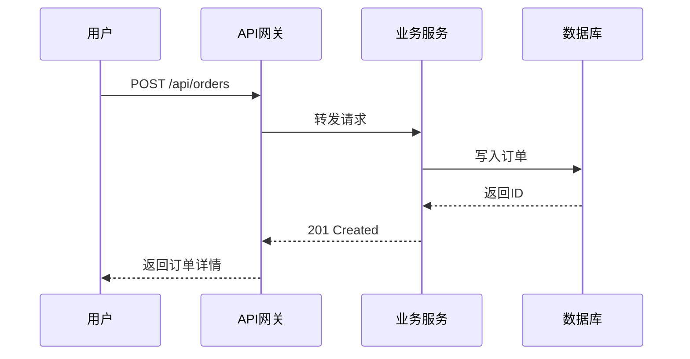
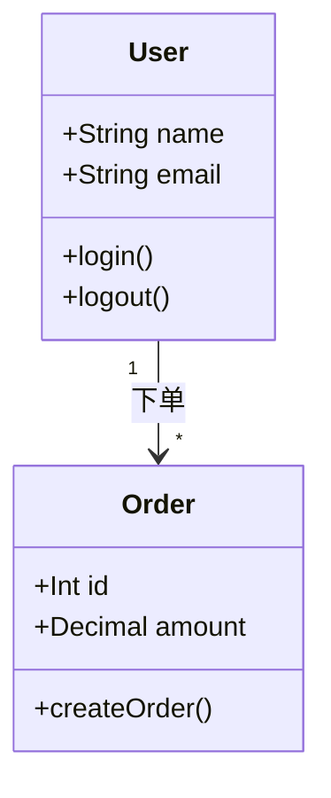
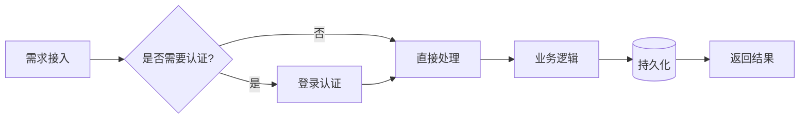
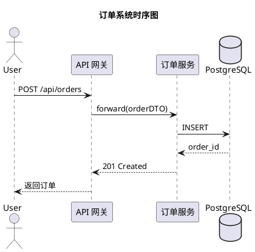
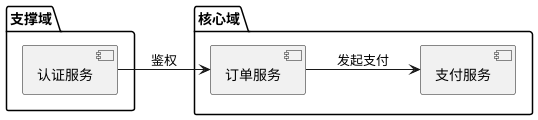

## 具体操作命令手册

### 1. 架构图绘制工具

**Mermaid（嵌入式 Markdown 图）**







**PlantUML（复杂 UML 图）**





**Ditaa（文本转图）**

```
+----------+        +----------+
|  Client  |------->|  Nginx   |
+----------+        +----------+
                         |
                    +----------+
                    |  App     |
                    |  Server  |
                    +----------+
                         |
                    +----------+
                    |PostgreSQL|
                    +----------+
```

文件内嵌即可用 ditaa 渲染为 PNG（VS Code PlantUML/Ditaa 插件 或 `ditaa input.txt output.png`）。

### 2. 代码库分析

```bash
# 按语言统计代码行数（JSON 输出）
pygount --format=json --output counts.json . && jq . counts.json

# 多语言代码计数（排除依赖目录）
cloc --exclude-dir=node_modules,vendor,dist,target,__pycache__ .

# 快速行数统计
wc -l $(find . -name '*.py' -not -path '*/node_modules/*')

# 项目目录树（过滤构建产物）
tree -L 3 -I 'node_modules|target|dist|__pycache__|vendor|.git' .
```

### 3. 依赖分析

```bash
# Python 依赖树
pip install pipdeptree && pipdeptree --warn fail

# Node.js 依赖树（两层深度）
npm ls --depth=2 2>&1 | head -100

# Go 依赖图
go mod graph | head -50

# Rust 依赖树
cargo tree --depth 2
```

### 4. API 设计与校验

```bash
# 从 OpenAPI 规范生成客户端 SDK
openapi-generator-cli generate -i spec.yaml -g typescript-axios -o ./generated-client

# OpenAPI 规范校验与风格检查
redocly lint openapi.yaml

# Swagger Codegen 规范校验
swagger-codegen validate -i spec.yaml
```

### 5. ADR（架构决策记录）模板

```bash
# 初始化 ADR 目录和模板
mkdir -p docs/adr && adr init docs/adr

# 创建新的架构决策记录
adr new "Use PostgreSQL as primary database"

# 查看已记录的 ADR
ls docs/adr/*.md | xargs -I{} basename {}
```

ADR 单条结构参考：

```markdown
# ADR-001: Use PostgreSQL as primary database

- **状态**: Accepted
- **日期**: 2026-07-23
