# Hermes Agent 集群 — 设计文档

> **摘要**：一个「多领域专业 agent 集群」工程协作系统——单一调度入口（orchestrator）+ 46 个定制化专业 worker 分布在 10 板 11 团队（含总调度台共 47 个 agent），像一支工程团队一样协作，而非 47 个聊天机器人各自为战。系统按七个机制域组织：S1 调度与编排 / S2 组织与能力边界 / S3 治理与验收 / S4 成本工程 / S5 知识资产治理 / S6 韧性安全垫 / S7 领域能力。

> **本文档为 as-is 设计文档**：描述系统的设计本身，只写现在时——不记版本历史、不记运行数据、不谈调研过程。所有数字经机械验证（最后验证：2026-09-07，验证命令见各表「验证方式」列）。待裁决事项与上游 GAP 对照属工作台账，不入本文档（见 `research/hermes-cluster-pending-and-gap.md`）。
> **总纲**：本集群与 SwarmStudio、swarm-yuan 组合成的研发系统，总纲是一句话——「人定方向 · 机器守门 · AI 干活」：AI 员工多了之后，质量不能靠模型自觉，必须靠机制。组合按三层投影：SwarmStudio 驾驶舱=人机界面层（人定方向、看清证据）；本集群=组织控制层（AI 干活、机械验收守门）；swarm-yuan 目标技能=机制执行层（守门落进编码回路）。
> **定位**：本文档讲「组织及工程控制」——47 个 agent 如何编队、调度、度量、隔离、兜底；agent 个体的专业能力（需求分析/代码开发/回归测试三个 AI 研发员工，与 swarm-yuan skill 的可靠性设计）由配套文档《AI Agent Teams 研究报告》讲述，本文档不展开。两份合起来，讲清研发过程的准确与可控。
> **写给谁看**：集群的维护者和新加入的 agent（人或 AI），解决「这个系统为什么这样设计、各部分怎么配合」的问题。**主旨**：把「多领域专业 agent 集群」从能对话的 Bot 群升级为可审计、可度量、可回滚的工程协作系统。
> 修改纪律：改动系统后同步更新对应小节；数字一律用机械命令现算，禁止沿用旧值；纯度自检通过后才算更新完成。

---

## 一、系统定义与设计目标

把「多领域专业 agent 集群」从**能对话的 Bot 群**升级为**可审计、可度量、可回滚的工程协作系统**。五条设计目标，各自由一个机制域兑现：

| # | 设计目标 | 兑现域 |
|---|---|---|
| 1 | 确定性调度：消息洪峰下路由判定不漂移，按量化规则分级而非感觉 | S1 |
| 2 | 能力圈隔离：互斥领域（攻防×教育）同机共存且互不污染 | S2 |
| 3 | 治理可度量：规则是否被执行有数据答案，完工声明必须拿机械证据 | S3 |
| 4 | 成本工程化：砍注入不砍能力，边际成本受控 | S4 |
| 5 | 全量可回滚：任何批量改动可恢复，备份有效性以演练证明 | S6 |

| 规模维度 | 现状 | 验证方式 |
|---|---|---|
| Agent profile | **47**（11 团队 + orchestrator；另有 _trash/_bak-maxturns 归档目录不计） | `ls ~/.hermes/profiles | grep -vE '^(_trash|_bak|_shared)$' \| wc -l` |
| Kanban 看板 | **10 业务板**分库（另有 guardrail-test 测试板、_archive 归档板与 data 空板，不计业务编制） | `ls ~/.hermes/kanban/boards` |
| skill 手册库 | **728** 份（47 个类目目录；另有归档区 `skills/archive/`：25 份本集群收敛下架 + 4,420 份/42 包历史包，均不在任何人白名单内，可一条命令召回） | `find -L ~/.hermes/skills -name SKILL.md \| grep -v /archive/ \| wc -l` |
| 治理规则 | **六层架构目录 17 规则 md + 2 契约 yaml + 46 扩展资产**（`_shared/` 按三层投影重组为 `01-scheduling-bus` / `02-org-orchestration` / `03-evolution-memory` / `04-pro-capability` / `05-eng-execution` / `06-observability` 六目录，另有 knowledge/、decisions/、evals/、failures/、templates/、scripts/、skills/、workflows/） | `find profiles/_shared/0* -name "*.md" \| wc -l`；`find ~/.hermes/profiles/_shared -type f \( -name "*.md" -o -name "*.yaml" \) ! -path "*/.git/*" \| wc -l` |
| 运维脚本 | **41**（`~/.hermes/bin/`，口径排除 `*.bak` 与 `__pycache__`，含 uv/uvx 两个二进制 shim） | `ls ~/.hermes/bin/ \| grep -Ev '\.bak\|__pycache__' \| wc -l` |
| 领域知识库 | **pay 库 31MB**（git 化 tag 锁定）+ **data 库**（版本锁定表 + 四域能力体系，见 §5.10）+ **eda 调研库**（三份产业链调研，见附录 B.1）+ **k12edu 活动库**（见 §5.11） | `du -sh ~/.hermes/profiles/pay-orchestrator/references` |

---

## 二、架构总览

### 2.1 结构形态：四层组成与数据流向

**核心命题：让一个调度入口（orchestrator）+ 46 个定制化专业 worker 像一支工程团队一样协作，而不是一堆聊天机器人各自为战。**

读法：**从左往右看数据流（消息→调度→执行→反馈），从上往下看控制流（接入→调度→执行→支撑），从外往内看结构（入口是唯一入口、执行层按板隔离、支撑层全局共享）。**

```mermaid
graph LR
    subgraph IN["① 接入层（外）"]
        MSG["Gateway 消息<br/>Matrix / Weixin / API Server / Email"]
    end

    subgraph ROUTE["② 调度层（唯一入口）—S1"]
        ORCH["orchestrator<br/>只调度不执行 · 三级量化路由<br/>建卡 triage / parents 依赖（仅同板）"]
    end

    subgraph EXEC["③ 执行层（10 板分库 → 11 团队 46 worker）—S2/S7"]
        subgraph KB["Kanban 10 板分库"]
            SW["swarm"]
            HK["hack"]
            PD["product"]
            OP["ops"]
            ED["eda"]
            PL["platform"]
            K12["k12edu"]
            AI["aiteam"]
            PAY["pay"]
            DT["data"]
        end
        subgraph TEAMS["11 业务团队（10 worker 团队 + 总调度台）"]
            T1["swarm(3)<br/>coder/researcher/tester"]
            T2["hack(4)<br/>recon/exploit/auditor/forensics"]
            T3["product(2)"]
            T4["ops(4)"]
            T5["eda(10)<br/>arch/ipcore/dv/backend<br/>ams/physics/toolchain<br/>pdk/packtest/ai"]
            T6["platform(2)"]
            T7["k12edu(7)"]
            T8["aiteam(6)<br/>arch/mm/embodied/training/scout"]
            T9["pay(4)<br/>infra/clearing/fintech/orch"]
            T10["data(4)<br/>arch/flink/infra/orch"]
        end
        KB -- "系统按各板名册派发<br/>只派给本团队成员" --> TEAMS
    end

    subgraph SUPPORT["④ 支撑层（全局共享）—S3/S4/S5/S6"]
        S1N["cc-switch 单代理 → glm-5.3-flash（S4）"]
        S2N["_shared 治理规则六层目录 17+2 件（S3）"]
        S3N["bin 运维脚本 40 个（S3/S6）"]
        S4N["Hindsight 外部记忆（S2）"]
        S5N["手册白名单挂载（S5）"]
        S6N["备份 → 外部盘 nvme2230（S6）"]
        S7N["pay 知识库 git 版本锁定（S7）"]
    end

    MSG --> ORCH
    ORCH --> KB
    KB -- "合并报告/留痕" --> ORCH
    TEAMS -.-> SUPPORT
```



### 2.2 组织形态：团队编制与四维定制

每个 profile 由四个维度定义能力圈：**toolset**（能用什么工具）、**skill 白名单挂载**（能读哪些领域手册）、**clearance**（能接触什么密级）、**SOUL+rules**（守什么岗位纪律）。大白话读表法：每行是一个「AI 员工」，四列分别回答——能用什么工具、挂几本手册、能读什么密级、守哪份说明书。粗体 = 该团队独有特征。

> 手册挂载走**白名单架构**（§5.4 详述）：配置里声明每个 agent 挂哪些手册（按类目 + 单点指定），没声明的不可见，归档的可按需召回。下表 skills 列为实测挂载数（口径：`hermes skills list -p <profile>` 的 enabled 手册数，含 builtin+local；挂载量随主库增长自动扩）。

| 团队 | profile | 工具集 | skills 挂载 | clearance | 私有规则 | 领域定制要点 |
|---|---|---|---|---|---|---|
| **orchestrator** | orchestrator | hermes-cli / **kanban** / memory / **messaging** | 268（devops-rd 类目白名单共有之一） | TLP:GREEN, CLEAR | SOUL + rules(43K) | 唯一保留 4 个 hermes-studio-* MCP；唯一 Gateway 入口（S1/S2） |
| **swarm** | worker-coder / worker-researcher | hermes-cli / **acp** / kanban / memory | 268 | GREEN, CLEAR | SOUL + rules | 带 acp（可委派 Claude/Codex/OpenCode）；coder 守 Shift-Left（每个功能块完成即跑测试，不等全部写完） |
| | worker-tester | hermes-cli / **acp** / kanban / memory | 238 | GREEN, CLEAR | SOUL + rules | 限定测试/对账 |
| **hack** | hack-recon | hermes-cli / kanban / memory | **323**（cybersecurity/red-teaming/hack-team 全类目） | **TLP:AMBER**, GREEN, CLEAR | SOUL + rules | 杀伤链第一棒；保留侦察子域 |
| | hack-exploit | hermes-cli / **acp** / kanban / memory | 323 | AMBER, GREEN, CLEAR | SOUL + rules | 唯一 hack 带 acp（外部 PoC runner） |
| | hack-auditor | hermes-cli / kanban / memory | 323 | AMBER, GREEN, CLEAR | SOUL + rules | 静态分析/审计子域 |
| | hack-forensics | hermes-cli / kanban / memory | **512** | AMBER, GREEN, CLEAR | SOUL + rules | IR/取证子域 |
| **product** | product-manager / product-researcher | hermes-cli / kanban / memory | 89 / 88 | GREEN, CLEAR | SOUL | 2 profile 共用规则 |
| **ops** | ops-devops | hermes-cli / **acp** / kanban / memory | 238 | GREEN, CLEAR | SOUL | 带 acp（外部 SRE/coder） |
| | ops-eval / incident-commander / sre | hermes-cli / acp / kanban / memory | 229 / 229 / 228 | GREEN, CLEAR (+**EYES-ONLY:ops** for eval) | SOUL | 领域职责分工 |
| **platform** | platform-ontology-curator | hermes-cli / acp / kanban / memory | 258 | GREEN, CLEAR, **EYES-ONLY:platform** | SOUL | 本体治理 |
| | platform-skill-miner | hermes-cli / acp / kanban / memory / **skills** | 258 | GREEN, CLEAR, EYES-ONLY:platform | SOUL | 唯一带 skills 工具集（装卸 skill） |
| **aiteam** | aiteam-orchestrator / architecture / multimodal / embodied / scout | hermes-cli / kanban / memory | **61**（research+software-development 两类目，最收敛编制） | GREEN, CLEAR | SOUL + `<profile>_rules.md` | AI 前沿调研五岗 |
| | aiteam-training | hermes-cli / **acp** / kanban / memory | **66**（+mlops 类目） | GREEN, CLEAR | SOUL + rules | 唯一 aiteam 带 acp（训练/推理工程外协） |
| **pay** | pay-orchestrator | hermes-cli / kanban / memory | 241 | GREEN, CLEAR | SOUL + rules | 领域网关；知识库总索引+覆盖对账 |
| | pay-infra / pay-clearing / pay-fintech | hermes-cli / kanban / memory | 261 | GREEN, CLEAR | SOUL | 基础设施/清算账务/金融科技合规三向分工；共享 git 化标准规范知识库 |
| **data** | data-orchestrator | hermes-cli / kanban / memory / **messaging** | **236** | GREEN, CLEAR | SOUL | 领域网关+口径/分级裁决；四域责任矩阵问责 |
| | data-arch / data-flink / data-infra | hermes-cli / **acp** / kanban / memory | **261**（含 data-science/devops-rd 类目） | GREEN, CLEAR | SOUL | 分层建模/指标字典/Flink 作业与脱敏管道/存储与权限审计；SOP 载体见 §5.10 |

> 本表列 11 个团队 46 个 profile（含 orchestrator 共 47）；eda（10 岗）与 k12edu（7 岗）两个领域团队的编制与领域契约详情见附录 B。

**能力圈隔离的结构性事实**：
- 白名单挂载差距即注入成本差距：教育团队按最小集挂载（64 份，4 类目），安全团队全类目最宽（323-512 份），领域团队挂载明细见附录 B
- 网络安全 skill（407 份，六个类目：cybersecurity-defense 148 + cybersecurity-detection 129 + cybersecurity 39 + cybersecurity-forensics 60 + cybersecurity-compliance 5 + hack-team 26）只进 hack 4 profile 的类目白名单
- EYES-ONLY 域锁：领域团队各锁本域（eda / ops-eval / platform），防跨团队读未授权数据；PII 锁：涉及家庭隐私的团队全员加锁（k12edu，见附录 B.2）
- toolset 收敛：27 profile 带 acp（外协岗按需，分团队配置）、3 带 messaging（Gateway 出入口：orchestrator、k12edu-orchestrator、data-orchestrator）、1 个带 skills（platform-skill-miner 自身治理）；各团队岗位级 toolset 明细见附录 B
- **派单名册隔离**：每块看板声明自己的成员名单（`board.json` 的 `profile_scope`），系统只把活派给本板成员——aiteam 板只见 6 个 aiteam 岗位，k12edu 板只见 7 个教育岗位，eda 板只见 10 个 IC 岗位 + orchestrator，pay 板只见 4 个 pay 岗位，data 板只见 4 个 data 岗位（双向实测）；未声明名单的板保持全量（向后兼容）。隔离覆盖调度层（dispatcher 派单门）与分解层（decomposer 派单名册，`kanban_decompose.py::_build_roster()` 消费同一份 profile_scope，patch 持久化于 `~/.hermes/profiles/orchestrator/patches/`，hermes update 后回放）

### 2.3 七大机制域总览

系统按职能分为七个机制域，各回答一个不同的问题。这个划分来自对外部多智能体实践（开源 agent 仓库源码、成熟 skill 库、PMO 实践）与本机审计结果的归纳——调研存档全部在 `research/` 目录，此处只讲结论，对象清单与原始锚点见台账 `research/hermes-cluster-pending-and-gap.md`。

| 域 | 回答的问题 | 一句话机制 |
|---|---|---|
| **S1 调度与编排** | 活从哪来、怎么分 | 所有外部消息从一个入口进来，量化规则分级，大事拆小、按名册派给合适团队 |
| **S2 组织与能力边界** | 谁是谁、谁能干什么 | 47 个 agent 的工具/手册/密级/纪律在编制时定死，互斥领域机械隔离 |
| **S3 治理与验收** | 怎么知道大家真照规矩干了 | 只读脚本度量执行率；「干完了」必须拿机械证据；重型交付物过对抗评审；变更按三分法授权（§3.2）；理论底座=控制论双书（§5.13）+ITIL 变更治理（§3.2） |
| **S4 成本工程** | 钱花在哪、怎么省 | 只动注入侧不动能力侧：压缩参数统一派生、MCP 剪枝、白名单注入、模型路由收口 |
| **S5 知识资产治理** | 手册库怎么管 | 主库/归档/挂载三层；白名单机制；按正文实证能力而非文件名分类 |
| **S6 韧性安全垫** | 改坏了怎么回来 | 改前快照、整库备份外部盘、工作区持久化；不演练的备份视为假备份 |
| **S7 领域能力** | 专业知识从哪来 | 每个团队靠领域调研喂养专业知识，固化为本团队的 skill 手册与岗位编制 |

七个域不是并列模块，而是一条运转链：**S1 调度拆出活 → S2 有边界的团队接活干（专业能力来自 S7 的喂养）→ S3 度量过程、验收产出 → S3 的度量结论驱动 S4 成本收敛与 S5 资产裁剪（二者互为表里：按真实内容分类决定白名单装什么，白名单机制保证省钱的效果不回退）→ S6 的回滚垫底让以上所有改动敢持续进行**。S4 的成本收口在 cc-switch 代理单点——用配置极简换单点风险（显式接受，靠代理自身熔断/队列缓解）。

---

## 三、机制设计（按域）

### 3.1 S1 调度与编排

系统只有一个调度入口 orchestrator，它只做路由、分解、派工，不亲自执行。路由按三级量化触发：工具调用 ≤2 且零写入的轻量消息直接回复；工具 3-5 次或写入 1-2 个的中等任务执行后留痕；工具 ≥6 或写入 ≥3 或涉及研究/编码/安全/部署的重型任务先看板立卡评审（triage=先立项再动工）再执行。派单按看板名册隔离——dispatcher 只认本板编制（`board.json` 的 profile_scope），跨板不互派。重型任务拆子任务时用 `parents=[...]` 声明依赖（硬约束：仅同板有效，跨板依赖改用 body 引用 + `context_from` 注入）；命名、schema、API 形态等设计决策由 orchestrator 派单前定死写进子卡 body，绝不让两张子卡各自决定同一个问题。**可复用的多步流程固化为工作流定义**（YAML 声明步骤链：专家执行→对抗评审→综合，含「等人类拍板」环节——卡挂起等回复、超时按预案升级或放行），由 orchestrator 按定义建出一串带依赖的卡来执行，不靠每次临时现想。存储层 10 板分库消除写锁竞争，网关层单端口多路复用（multiplex_profiles，全渠道收敛 8650）消除域间干扰。需求澄清与任务分解分别接入 `grilling`（把需求的每个分支问到底才动手）与 `to-tickets`（每个任务切片都端到端可验证）两个方法论 skill。

### 3.2 S2 组织与能力边界

47 个 agent 按「团队+看板」组织为 11 个团队，能力圈由四维定义（toolset / skill 白名单 / clearance / SOUL+rules，见 §2.2）。互斥领域同机共存且互不污染，靠三层机械隔离：**skill 注入层**——407 份网络安全手册只进安全团队 4 个成员的视野（白名单挂载），k12edu 教学手册进不了 hack 上下文；**调度层门禁**——每个看板在 `board.json` 声明自己的成员名册（profile_scope），dispatcher 每轮派单前机械核对「被派的人在不在这个板的名册里」，不在就跳过并留下 out_of_scope 事件（`kanban_db.py` 派单循环内校验）；**建卡层门禁**——向看板建卡时同步核对 assignee 与名册，越域建卡直接报错拒绝（`kanban_tools.py` 创建路径校验）。全集群唯一例外是 orchestrator：作为总调度入口可跨板派单，由各板的 `dispatcher_bypass` 白名单显式授权。名册未声明的看板不受影响（向后兼容）。

密级沿使用链自动传播：产出的东西带密级标签（TLP=对外披露分级，EYES-ONLY=仅限指定团队，PII=含个人隐私），谁引用了它谁就自动继承同等密级——多重标签同时生效时取最严的一档，派单前由脚本 `clearance_gate.py` 机械校验。记忆按 team 隔离共享（Hindsight bank `hermes-<mac>-<team>`，跨机自动隔离）。

**动作权限按「谁能批」与「什么事」两个维度分别收敛**：每个 agent 有权限等级（自主执行/仅提案/必须上报），每类事务有作用域（资金/发布/部署/删数据/凭证），两维交叉定门——没声明权限的一律按「仅提案」处理，拿不准就往严里走。执行层审批模式全部 47 profile 统一 smart，硬红线规则在一切自动放行之前生效。高危写不只「等批准」，而是走 staged 闭环：先产出带服务端 ID 的变更提案（stage），人类在真实审批面批准后才能 apply，且 apply 时按当时的限额把全部护栏重跑一遍——模型最危险的动作是提议，执行与校验都归系统。变更按 ITIL 4 三分法授权：standard=预授权程序化变更（机械验收门即授权）/ normal=需评审授权变更（kanban review 卡）/ emergency=事故止血变更（AGENTS §六 24h 补验通道），三类定义与授权矩阵见 `_shared/03-evolution-memory/action-risk.md` §1.3「变更授权矩阵」，变更类型以 kanban metadata `change_class` 字段标注。

### 3.3 S3 治理与验收

治理围绕「让规则是否被执行有数据答案」展开，三个支柱。**度量先行**：只读采集脚本（40 个运维脚本，含复用率统计、协议执行率月报、token 计量、验收拒绝率与路由留痕月报）建立执行率/复用率/token 基线，未接线的机制一律标注「提案·试运行」+ 生效条件，连续 2 月零执行的协议自动降级或删除；度量脚本全部只读——采集器不能成为被测系统的写入者。**机械验收**：任何「已完成」声明必须机械验证（sqlite 查行数 / grep 查引用 / 文件实读 / 改动前后对比），按证据强度四档定分——Present（存在）< Wired（接线）< Exercised（用过）< Outcome-supported（见效）。验收声明在工具层强制：`kanban_complete` 缺省不填 `metadata.verification` 时自动补 `evidence_strength=unobserved`（最低档，逼 worker 主动声明，2026-09-07 落地于 `kanban_db.py`），summary 按 evidence_strength 自动加 `[UNVERIFIED]`/`[VERIFIED]` 前缀——「宣称完成但未声明证据」在工具层不可见地消失。**输入净化与模型信任边界**：进入模型上下文的第三方文本（网页抓取、tool 返回、用户粘贴块）过确定性净化器——剥离不可见 Unicode 载荷、中和伪造的对话边界、剥除仿冒系统/工具标签（剥到不动点）、整体封顶尺寸；检测（判风险）与净化（中性化后放行）双向分工，语义级注入仍走 Guardian 二审。**对抗评审**：重型交付物（合并报告等）交付前过 Committee——一名质量评委加两名没参与干活的领域委员并行挑刺，评审针对冻结的只读快照（commit/attach 版本锚点）进行，评审期间交付物不再修改、修改项作 rework 另行处理；产出带严重度分级的批判清单，由一人修订闭环；高危发现未处置不得交付，评审者故障时降级为单评审不阻断交付。多轮推进的重型任务合并报告必含「已验证行为 / 未验证遗留」两节，下游任务据此规划、不靠猜重建哪些结论可信。**幻觉完成有修复引导**：`kanban_complete` 引用不存在的卡 ID 时，拦截错误（`HallucinatedCardsError`）携带 verified/phantom 分区——明确告知「哪些卡真实存在、如何修正重试」，拦截从「只报错」升级为「引导修复」，worker 不因一次幻觉被卡死在重试循环（2026-09-07 落地）。治理纪律本身固化为 `_shared/` 下 19 个规则文件加 5 件配套资产（统一的产出物词汇表、动手前先侦察的流程、分层完成标准、独立检查者制度、对抗评审协议、推送防骚扰规则、告警分级规则、工作流定义规范、密级传播规则、高危动作审批、失败案例库、风险登记册等），把工程纪律从口头要求变成有出处、可查验、随内容自动生效的规则网络。orchestrator 的治理视角同时覆盖项目组合：组合健康度简报、风险登记册、失败模式对策库（含月度排除表复核——已证伪路径的排除表自身防「错误排除」退化，见 §5.13）。**协议违规消费闭环**：周度 cron（`protocol_violation_consumer`，周一 02:00）扫全部业务板的 `protocol_violation`/`suspected_hallucinated_references` 事件并按 worker 聚合——事件在 `task_events` 只记录不消费=半反馈（金书），必须有消费者把「重复违规」升级为根治卡才构成完整负反馈（2026-09-07 上线）。治理机制的理论底座（控制论双书 21 主题透镜）见 §5.13。

### 3.4 S4 成本工程

成本收敛只动注入侧、不动能力侧。四条机制：① **压缩参数一处定义、处处生效**——全部 47 个 agent 的自动压缩参数统一为「上下文用到 35% 开始压缩、压到剩 15%」，写在共享配置 `~/.hermes/shared/profiles.yaml` 里统一派生，重新生成配置也不会回退，存量由 `sync-compression.py` 脚本定点同步；② **MCP 剪枝**——MCP 是外部工具的接入协议，每个接入的工具说明都占注入量；非 orchestrator 的桌面工具类 MCP（hermes-studio-*）全部禁用，orchestrator 独留（唯一需要桌面交互）；③ **skill 注入面收敛**——注入的只有挂载集合的 name+description，正文按需加载；④ **模型路由收口**——47/47 profile 统一 glm-5.3-flash 模型 + cc-switch 本地代理（127.0.0.1:15721）透传，上游切换/熔断/限流全部收口代理层，Hermes 侧不感知上游差异，顶层 `fallback_providers` 断链兜底；推理档位主对话 ultra、机械子任务走 auxiliary 分级降档——辅助任务现有 13 项（title/approval/compression/vision/triage_specifier/kanban_decomposer/goal_judge/session_search/profile_describer/moa_aggregator/moa_reference/background_review/web_extract），按任务各自声明 api_mode+model+provider 低耗档。

### 3.5 S5 知识资产治理

skill 库按三层结构治理：**主库** 748 份 skill 手册（47 个类目目录）→ **归档区** 4,420 份（42 个归档包，低频/一次性手册，有索引清单可全文搜索，一条命令按需召回；`_` 前缀备份目录与历史备份包不计入）→ **挂载**（每个 agent 只挂白名单内的 61-512 份，按类目白名单随主库增长自动扩）。白名单机制（fence）：共享配置里按「类目 + 单点指定」两层声明每个 agent 挂哪些手册，没声明的默认不挂——新增手册不会自动涌进所有人的视野。新手册入库后自动同步到实体目录挂载的 agent，符号链接（symlink）挂载的 agent 跑一次批量补链脚本即可。

分类依据是**正文实证能力**而非名称/目录：手册入库时逐本记录「能力卡」（真讲什么、属于攻击流程哪一环、用什么工具、能不能上手），名不副实者不入白名单（能力卡方法存档 `research/skill-deep-dive/`，固化于 skill `skill-capability-based-pruning`）。裁剪公式简单直接：一本手册的注入价值抵不过它名字占的 token，就禁用；剔除仅限实证全团队都不相关的项。引入外部手册仓库时逐本判定「集群缺不缺这一本」，按新建/增强/已有/跳过四档处置；落地后逐层验证分发到位（入库→分发→内容比对→全量 agent 实际可达）。

### 3.6 S6 韧性安全垫

一切批量改动可回滚。三条保障：① **改动前快照**——批量改配置先把原状整体搬进带时间戳的回收目录（附一份改动清单），确认无误后才真正删除；② **全量备份**——skill 库整库打包落外部盘（`/Volumes/nvme2230/hermes-backups/`），打包时把符号链接展开为实体文件（防止备份里出现指向已删除文件的空链接），外部盘隔离系统卷故障；关键规则文件 `.bak` + 回滚演练；③ **工作区持久化**——任务工作区禁止用「一次性临时目录」（scratch，任务结束即清理），默认用 git worktree（带分支的持久工作副本），产物不丢；④ **配置基线**——SOUL/skills 配置经人工验收后打 `cfg-YYYYMMDD` tag 固化「已验证状态」，巡检时对账「基线之后动了什么」，漂移超阈值告警（§5.8）。备份有效性以演练验证——不演练的备份视为假备份。

### 3.7 S7 领域能力

每个团队以领域调研喂养专业知识，固化为本团队的 skill 与编制：hack 喂养安全工具链与红队方法论，eda 喂养集成电路全产业链开源工具链选型与 AI 自主边界判据，k12edu 喂养儿童认知发展与教学法学术依据（两团队编制与契约见附录 B），aiteam 以 AI 前沿版图调研定编制，product 喂养产品方法论与竞品调研，pay 喂养支付清算标准规范库（git 版本锁定，见 §5.9），data 喂养实时数仓架构/分析/治理/安全四域能力体系（见 §5.10），ops 喂养 ITIL 4 服务管理与 Google SRE 双谱系运维方法论（变更治理矩阵见 §3.2，配置基线见 §5.8，34 项实践映射调研存档 `research/itil-v4-absorption/`）。领域知识库必须**版本锁定**（git 固化）且**使用前置核实**——资料仅供参考，引用必须回查现行官方来源，防止过期/矛盾数据误导任务。专业知识沉淀为各团队自己的手册，按白名单只挂本团队——专业能力不外溢，与 S2 的能力圈隔离、S4 的注入收敛互为支撑。

---

## 四、运行形态

设计逻辑不仅落为静态的结构与组织，还落为动态的**运行机制**——各机制域如何运转、如何配合。

| 机制域 | 运行机制 | 运转方式 |
|---|---|---|
| **S1 调度与编排** | 按工作量大小分三档处理；各团队只从自己的任务池领活 | 消息进来→按工具调用次数/文件写入数定级→轻量直接答、中等留痕、重型先立卡→系统自动把卡派给对应团队的成员 |
| **S2 组织与能力边界** | 手册按白名单挂载；密级随内容自动传播 | 每个 agent 只看得见自己名下的手册；产出的内容带密级标签，被引用时标签跟着走 |
| **S3 治理与验收** | 只读脚本度量 + 完工必须拿证据 | 脚本定期统计执行率/复用率/token 消耗；「干完了」必须以数据库行数、文件内容等硬证据核验，口头声明无效 |
| **S4 成本工程** | 参数一处定义全局生效；用不到的工具说明不注入 | 47 个 agent 的压缩参数由一份配置统一派生；桌面工具类 MCP 只给调度者；安全手册只挂安全团队 |
| **S5 知识资产治理** | 手册分主库/归档/挂载三层；按真实内容分类 | 低频手册归档不删除（可按需召回）；一份手册值不值得挂载，看它正文实际讲什么，不看文件名 |
| **S6 韧性安全垫** | 改前留快照、整库有备份、工作区可持久、配置有基线 | 批量改动前先把原状存进回收目录；手册库整库备份到外部盘；任务工作区默认持久化，产物不随清理丢失；人工验收后打 cfg tag 固化基线，巡检对账漂移 |
| **S7 领域能力** | 每个团队靠专业调研建自己的知识库 | 安全团队沉淀攻击工具手册、芯片团队沉淀全产业链开源工具链与 AI 自主边界判据、教育团队沉淀教学法依据；专业手册只挂本团队，不外溢 |

**运行协同**：调度拆出活（S1）→有边界的团队接活干，干活的手艺来自各自的专业喂养（S2+S7）→干活的过程被度量、交付被验收（S3）→度量数据告诉我们哪里浪费、哪些手册没人用，驱动省钱和裁剪（S4+S5）→所有这些改动都有回滚垫底，才敢放心持续优化（S6）。一句话：**谁派活、谁来干、怎么督、怎么省、怎么防改坏、手艺哪来**，六个问题环环相扣。

---

## 五、实现配置

### 5.1 S1 调度与编排：编排与调度

**三级量化路由**（大白话：按活的大小分三档——顺手答 / 答完留个记录 / 先立卡再干）：

| 级别 | 量化触发 | 处理 |
|---|---|---|
| 轻量 | 工具调用 ≤2 且文件写入 =0 | 直接回复，不留痕 |
| 中等 | 工具 3-5 或写入 1-2 | 执行后 kanban_create+complete 轻量留痕 |
| 重型 | 工具 ≥6 / 写入 ≥3 / 研究·编码·安全·部署 | 先建卡 triage 再执行，分解子任务 |

**路由留痕与打回约束**（控制论双书融合，机制设计论证见 §5.13）：
- **路由留痕**：Gateway 消息路由完成后，所建 kanban 卡 body 首行写 `routed:<级别>:<工具数估>`（如 `routed:medium:4`）——路由覆盖率是可度量变量而非印象；月度由 `acceptance_routing_metrics.py` 聚合（§5.6）。控制论依据：可观察变量不开拓，反复循环也不能逼近真理（金书§5.3）——「先开变量再谈治理」。
- **打回约束**：`kanban_request_changes` 必须附**修改方向+边界**（改什么/不改什么/重验判据），reason 首行打 `[REJECT:<FM模式>]` 结构化标记（模式查 failure-mode-playbook 定）——裸「需要修改」让 worker 在两极端间振荡烧预算（反馈过度，金书§5.6）；标记同时补上 request_changes 在 task_events 无痕迹的观测缺口。
- **验收项清晰性门**：frozen 验收区每条必须二分可答「什么算通过/不通过」；`质量要高`/`完善 X` 类 0 信息量表述禁入（模糊验收不可检验则不可修正，金书§5.4 理论清晰性=信息量）；探索型任务允许终点模糊但须给代理判据（覆盖面/对比矩阵）。固化于 skill `delegation-brief-format` §2.1。
- **失败打标扩展**：四标签（§5.5 output-contract 行）覆盖面从 block/request_changes 扩展到全部失败收尾路径（crashed/timed_out/gave_up 自知时）——失败不打标=无记忆随机控制（金书§1.4-1.5，已证伪路径不被排除则同类失败必然复发）；打标覆盖率进月度聚合（首月目标 ≥30%）。

**任务分解与依赖**：
- 重型任务拆子任务，`parents=[...]` 表达依赖（大白话：声明「哪张卡先干完才轮到哪张」）；**硬约束：parents 仅同板有效**（dispatcher 父检查是板内 JOIN，跨板 parent 静默落空→子卡被错误放行）。跨板编排用子卡 body 引用父卡 ID + `context_from` 注入。
- 设计决策归属 orchestrator：命名/schema/API 形态派单前定死、写进每个子卡 body——worker 之间看不到彼此上下文，**绝不能让两张子卡各自决定同一个问题**。
- **名册隔离**：每块看板在自己的配置里声明本板成员名单，派单时只见本板编制；未声明名单的板保持全量（向后兼容），配置损坏时降级为不隔离而非报错停摆。

**Kanban 存储**：10 板分库（`boards/<板>/kanban.db`），单库是并发写锁竞争点；全局 `~/.hermes/kanban.db` 为旧版残留（会话 kanban 工具不带 `board=` 参数仍会写入此库且 dispatcher 不扫描——建卡必须带板名）。workspace_kind 禁 scratch（S6 安全垫设计）。

**工作流定义**：可复用的多步流程在 `_shared/workflows/` 以 YAML 声明（步骤类型：专家执行/对抗评审/综合/等人类拍板），orchestrator 按定义建带 `parents` 依赖的卡链执行。「等人类拍板」环节落为卡挂起（block）+ 回复后恢复（unblock）+ 超时预案（升级/放行/失败三档）——复用 kanban 原生状态机，不引入新状态。内置流程：深度调研+对抗评审+综合交付。

**Gateway**：launchd 监管（KeepAlive 自动拉起，plist 由 `generate_launchd_plist()` 生成，禁手写变体——与官方版不一致会被 plist 一致性检查 bootout）。**单端口多路复用**：`multiplex_profiles: true`，全部渠道（API Server / Matrix / Weixin / k12edu 微信号）统一收敛 8650 一网关；微信渠道由 multiplexer 代连（k12edu 微信号含内），禁任何 profile 级独立 gateway 并存——残留 launchd plist（KeepAlive）会与 multiplexer 抢 Weixin token 致 multiplexer parked，排查口诀：查 `~/Library/LaunchAgents` 有无 profile 级 gateway plist，有即 stop + uninstall + 重启 multiplexer。API Server 消息不走 Kanban（同步问答语义，留痕是噪声）。aiteam/pay 板复用主 8650 网关（同一 dispatcher 扫全部业务板分库，dispatch 与 profile 目录解耦）。**出站推送防骚扰**：agent 主动推给人的消息过三重闸——内容去重（同内容短期内不重复推）、按人限频（单位时间条数封顶）、安静时段（夜间不推非紧急消息）；紧急消息豁免，闸门自身故障时放行不丢消息（宁多推不漏推）。**告警分级**：推送内容先分四级（紧急/高/中/低），拿不准一律往低档放；涉及薪酬、法律、财务明细、家人隐私、密钥的内容禁止广播——只看级别走对应渠道。

### 5.2 S4 成本工程：模型路由

- 47/47 profile 统一：`model.default=glm-5.3-flash`，provider `custom:cc-switch`（本地代理 127.0.0.1:15721，`api_key=PROXY_MANAGED`）+ **异构 `fallback_providers` 断链兜底**（2026-09-07 控制论复盘后全量落地：47/47 profile 按团队配 1-2 级异构上游——alibaba/qwen3-max 与 kimi-coding/k3 两档外部通道，主通道 cc-switch 熔断时自动降级切换；3 个团队实测熔断演练 PASS，含 worker-coder 的 glm→qwen3-max→k3 双级切换链；单点风险从「显式接受」转为「机械兜底」，R-01 缓解升级）
- **全局代理架构**：所有模型流量（主对话 + auxiliary 辅助任务 + API Server model_routes）统一经 cc-switch 本地代理，上游供应商切换/熔断/限流全部收口到 cc-switch 层（`~/.cc-switch/cc-switch.db` 的 proxy_config/provider_health），Hermes 侧不感知上游差异
- 47 个 agent 的主对话推理档位统一最高（ultra，推理质量即产品价值）；13 项辅助机械任务（起标题/压缩/审批/分解/评审判分/会话检索/视觉等）各自声明 `auxiliary.<task>`（api_mode + model + provider）走低耗档按任务分级降档
- **审批模式统一**：47 profile 全部 `approvals.mode=smart` + `single_query_mode/cron_mode/unattended_mode=approve`（kanban worker 本质是 `hermes chat -q` 走 single_query 通道，原 deny 会导致 worker 卡审批墙秒死；hardline 块与 approvals.deny 仍在 yolo/off 之前生效；改动生效需 /reset 或 gateway 重启）
- **ACP 外协通道三选**（claude / codex / zcode 三 provider 并存于 39 个 acp-client 配置，`plugins/acp-client/config.yaml` 的 `providers:` 段；39 份插件代码同哈希，含 zcode 分支与 per-provider env 透传——`ACPClient(env=)` 把 `providers.<name>.env` 注入子进程，改 env 后必须 kill 存活子进程否则沿用旧环境，每次 fleet 同步前后都要 md5 全量核验落盘产物而非信任部署脚本输出）：默认 claude（`/opt/homebrew/bin/claude-code-acp`）；**zcode 通道**（`/opt/homebrew/bin/zcode-acp-server`，`ZCODE_MODEL=GLM-5.3-Flash` 钉死防默认取 models[0]=GLM-5.3 照扣费）为 GLM Coding Plan 夜间畅用窗口（每日 23:00-09:00 北京时间，活动期 2026-09-03~09-20）的零额度编码委托通道——窗口内全自动 ACP 任务一律切 zcode，机械判定 `python3 ~/.hermes/bin/zcode_free_window.py`（`USE_ZCODE=1/0`）；免费边界仅限 zcode 通道本身，经 cc-switch 的一切 GLM 调用夜间照常计费；配套纪律注入 33 个 profile 的 SOUL（夜间窗口规则 + 免费不豁免验收）。夜间深度调研管线的 LLM 分析同样经此免费窗路由（`radar_llm.py` 咽喉层，见 §5.11）
- **单点风险：机械兜底 + 显式接受残余**：cc-switch 宕机时各 profile 按团队 fallback_providers 自动切异构上游（§5.2 首条，2026-09-07 起为第一道防线）；并发熔断看门狗三档降档（§5.12）为第二道；换配置极简仍保留为最后手段（risk-register R-01 缓解升级，残余风险=全部异构上游同时不可用）

### 5.3 S4 成本工程：上下文成本工程

| 机制 | 现状 | 要点 |
|---|---|---|
| compression | 主 config 与 47 个 profile config 统一为 `threshold=0.35` / `target_ratio=0.15` | `~/.hermes/shared/profiles.yaml` shared_config 为单一事实源（0.35/0.15），generate-configs 重建/新增 profile 自此值继承；`~/.hermes/bin/sync-compression.py` 为存量定点同步脚本（只改 threshold/target_ratio，不触发全量重生成） |
| tool_output 限制 | max_bytes=20000 / max_lines=500；file_read 50000 chars | 硬截断优于信任自律 |
| MCP 剪枝 | 非 orchestrator profile 的 hermes-studio-* 全 enabled:false（aiteam 6 个生成时即未配） | orchestrator 独留（唯一需要桌面交互） |
| skill 注入 | 白名单（§5.4）：只注入本 agent 挂载手册的名称+一句话简介 | 注入面为「白名单精确集合」 |

### 5.4 S5 知识资产治理：Skill 手册库治理（白名单挂载）

skill 库按三层结构治理：**主库 728 份 skill 手册（47 个类目目录）+ 归档区（`skills/archive/`：25 份本集群收敛下架的单点修复/同义合并手册 + 4,420 份/42 包历史包，索引清单可全文搜索，一条命令召回；`_` 前缀备份目录与历史备份包不计入）+ 各 agent 的挂载目录（符号链接与实体目录混合，白名单集合，每岗 61-512 份，按 `hermes skills list -p` 实测口径）**
- **白名单机制**：`~/.hermes/shared/profiles.yaml` 按两层声明每个 agent 的挂载集合——`skills_enabled`（按类目，如「全部安全类」）+ `skills_pinned`（指定某一本）；配置生成脚本据此产出各 agent 的配置与目录。默认不注入：没声明的手册一律不可见。落地为脚本 `skill-fence.py`（`~/.hermes/shared/`）
- **归档召回**：归档不删除——索引清单可全文搜索，一条 `skill-lifecycle.py restore <名>` 命令恢复；恢复后把它加进对应 agent 的白名单声明、重跑一次配置生成即可。本集群收敛归档分两区：`archive/single-fix/`（单点修复型 7 份，已被通用机制覆盖）与 `archive/merged/`（同义合并被归档方 18 份，主 skill 留在原类目）；归档区 README 记录恢复方式与主 skill 映射
- **目录单一事实源**：`_shared/06-observability/skill-catalog.md` 登记 active skill 的架构层归属/触发场景/适用 profile，新增必登记、每季度审计一次、同主题 ≤3 个 skill、禁止为单一 bug 建长期 skill
- 成本结构不变：注入的只有挂载集合的 name+description（每 profile 每轮），正文按需加载 → 收敛注入面=收敛成本
- 类目隔离：网络安全 6 类目（合计 407 份）只进 hack 4 profile；devops-rd 类目 13 profile 白名单共有（orchestrator/swarm 3/ops-devops/pay 4/data 4）；领域团队的类目与份数明细（教育 4 类目 64 份、芯片 7-8 类目 257 份等）见附录 B
- **外部手册引入**：外部 skill 仓库逐本判定「集群是否缺这本」，按新建/增强/已有/跳过四档处置；落地后逐层验证分发到位（入库→分发→内容比对→全量实际可达）

### 5.4.1 S5 知识资产治理：机制执行层技能（swarm-yuan）

swarm-yuan skill 是三层投影中「机制执行层」的具象载体：**通用工程能力（行业沉淀，可复用）+ 仓库特化约束（本仓沉淀，不可迁移）** 的复合体——通用层引用 devops-rd 各阶段方法论（verify-requirement/rd-apply/rd-validate），特化层内嵌目标仓库的工程规范、验收命令（command + expected_exit_code 机械可执行）与禁区清单。**守门点即特化层的验收命令**：AI 每轮编码后必须跑，红即打回，无自由裁量——这就是「机器守门」落进编码回路的物理载体。

生产走五阶段流水线（orchestrator profile 级 skill `swarm-yuan-componentization` v0.1.0 定义）：①调研掌握 Survey → ②规范提炼 Distill（验收命令实跑 exit=0 才出）→ ③组装 Assemble（skill 自包含、无支持件依赖）→ ④回路验证 Gate-Check（**≥1 次真实拦截记录才算门生效**，无拦截=Present 级证据不完成）→ ⑤注册流通 Register（登记 skill-catalog + 派发 worker profile）。仓库演化后走增量模式：特化层变更 kanban_comment 留痕，通用层禁仓库级私改。

### 5.5 S3 治理与验收：治理层 `_shared/` 六层架构目录（17 规则 md + 2 契约 yaml）

设计目标：把工程纪律从口头要求变成**有锚点、可审计、带传播机制的规则网络**。

`_shared/` 按三层投影组织为六个编号目录，orchestrator SOUL 按目录层级引用（不再逐文件罗列，SOUL 从 614 行收敛至约 220 行）：

| 目录 | 架构层 | 文件 | 职责要点 |
|---|---|---|---|
| `01-scheduling-bus/` | 调度总线 | `matrix-collaboration-termination.md` / `dynamic-workflow-protocol.md` / `forward-deployed-protocol.md` | 机器人防死循环七层防线（空转 8 轮熔断）；YAML 工作流→kanban 卡链+WaitForHuman 挂起；动手前先侦察六步 |
| `02-org-orchestration/` | 组织编排 | `ontology.md` / `marking-rules.md` / `alert-triage-rules.md` / `mandatory-privacy.md` | 六类产出物对象模型统一词汇；密级标签沿引用传播（多重取最严）+派单前脚本校验；告警四级存疑取低+隐私不变量禁广播 |
| `03-evolution-memory/` | 进化记忆 | `output-contract.md` / `exit-protocol.md` / `action-risk.md` / `review-gates.md` | 分层 DoD（重型报告必含「已验证/未验证」双节）；可逆性分级+Staged-Change 双重复验；质量门与评审生命周期（检查者独立于干活、评审绑定冻结快照） |
| `04-pro-capability/` | 专业能力 | `committee-review.md` | 对抗评审：1 质量评委+2 领域委员并行挑刺→1 人修订，severity=high 未处置不得交付，评审故障降级单评审不阻断 |
| `05-eng-execution/` | 工程执行 | `drift-comparison-template.md` | 攻击面漂移对比模板（recon baseline vs exploit snapshot） |
| `06-observability/` | 观测治理 | `risk-register.md` / `outbound-guard.md` / `swarm-studio-contract.md` / `skill-catalog.md` | 风险登记册（红区必附应对计划+合并报告强制 Review Top3）；出站防骚扰三闸；**SwarmStudio↔集群接口契约单一事实源**（数据/API/WS/权限/ACP 路由/验收证据分级/版本兼容/违约处置八节）；**skill 目录单一事实源**（§5.4） |

| 扩展资产 | 职责 | 设计要点 |
|---|---|---|
| `workflows/deep-research-synthesis.yaml` | 内置工作流 | 深度调研→对抗评审→综合交付 |
| `failures/` 3 案例库 | 结构化失败案例 | frontmatter（域/失败类型/模式反链）+五段式（情境/经过/根因/失误/教训）；与 failure-mode-playbook 模式表双向互链 |
| `evals/baseline.md` | 换模型回归评测基线（11 题）+ 评测方法纪律 | 题库（T1-T11 只增不删，事故回流追加）+ 出题五纪律：snapshot 式出题（预置状态直接注入，不靠伪造多轮）、正负配对（每个 should-serve 配 should-refuse）、判最终状态不判路径、rubric 判据无交集、毒化 fixture 只进评测环境且必配 should-serve 对照；回归通过后追加「脚手架复评减法环」——为弱模型搭的补偿性脚手架（逐字模板/强格式约束/高频提醒）逐项实测能否拆除，拆除走 deprecated-candidate→下轮回归全绿→正式移除，拿不准一律保留。机制 provenance 双链评估：机制入册标注创建链（谁建）+执行链（谁实测验证，缺测标 executor=unverified）双标签，减法审计只移除双实证脚手架（来源：HarnessDev 论文差距分析，gap-20260904-tech-001）；已验证修复防抹除——对同机制的再修改必须附「修复仍成立」复测证据，否则回滚到版本锚点；失败集 diff 为决策信号，top-line 通过率 ±1 题内波动视为噪声带 |
| `action-contracts.yaml` | 动作契约 | 不可逆的动作（如删库、外发）必须先提案、经确认再执行；与 `03-evolution-memory/action-risk.md` 联动：权限等级×事务作用域两维交叉定门，未声明一律「仅提案」；高危写走「staged→审批→apply 复验」闭环 |
| `constraint-policy.md` / `hack-knowledge-index.md` / `hack-tool-registry.md` | hack 域约束与资产 | 安全授权门禁；领域知识索引/工具注册表 |

### 5.6 S3 治理与验收：运维脚本 `~/.hermes/bin/` 40 个

| 类别 | 脚本 | 职责 |
|---|---|---|
| 度量 | `asset-compound-metrics.py` / `failure-label-check.py` / `token-meter.py` / `protocol-adoption-audit.sh` / `portfolio-brief.py` / `ttvv-report.py` / `process_metrics_collector.py` / `oel_collector.py` / `oel_aggregate.py` / `acceptance_routing_metrics.py` | 复用率/压缩率/执行率只读采集；token 实测基线；协议执行率月报（连续零执行自动触发降级）；TTVV 分层时长观测（兼容双时间戳格式）；8 板健康度简报（红黄绿灯+风险台账+待裁决项）；验收拒绝率与路由留痕月度聚合（§5.1，样本<5 输出 insufficient 防小样本误导）。cron 侧配套「协议违规消费」job（ops-devops profile，周一 02:00，扫 10 板违规事件按 worker 聚合——事件产生必须有消费者，§3.3） |
| 备份 | `skill-full-backup.sh` | 全量打包 tar -L 解引用，落外部盘 |
| markings | `clearance_gate.py` / `marking_selfcheck.py` / `kanban_add_markings_col.py` / `p9_marking_drill.py` / `kanban-direct-write-audit.sh` | 派单前权限机械校验；markings 列补齐与注入演练；裸写 kanban 审计 |
| 本体 | `ontology_validate.py` / `ontology-cq-regression.py` | 本体一致性校验 |
| RD Harness | `rd-export.py` / `rd-auto-reminder.py` / `rd-auto-backfill.py` / `rd-body-injector.py` | RD 过程产物归档与质量门自检 |
| 成本/通道 | `sync-compression.py` / `zcode_free_window.py` | 压缩参数存量定点同步；ZCode 夜间免费窗口机械判定（§5.2） |
| 测试 | `test_clearance_gate.py` / `test_ontology_validate.py` / `test_p6_process.py` | 护栏脚本自带单测（markings/本体/P6 流程三件） |
| 更新安全 | `hermes-update-safe.sh` / `tui-patch-watchdog.sh` | hermes update 前快照与 TUI patch 回放守护 |
| 其它 | `audit-soul-rules.sh` / `capability-graph-gen.py` / `parallel-wave-scan.py` / `skill-health-audit.sh` / `shadow-verification-audit.sh` / `orchestrator_context_query.py` / `qwen3_asr_stt.py` / `dashscope-image-gen.py` / `tupang-auto-push.sh` | SOUL 规则审计、能力图、并行波扫描、skill 健康审计、shadow 验证审计等 |

**设计要点**：度量脚本全部**只读**——采集器不能成为被测系统的写入者，否则度量污染数据。与脚本配套的确定性看门狗（`~/.hermes/scripts/`：`kanban_stuck_watchdog` 四形态、`cron_paused_watchdog`、`evo_concurrency_watchdog`、`ontology-metadata-watchdog`、`soul_integrity_watchdog`、`meta_watchdog`、微信补投队列等）挂载于 orchestrator cron，与 bin/ 的采集器分工：**采集器产基线，看门狗闭环处置**（详见 §5.12）。`~/.hermes/scripts/` 中的度量采集器（`acceptance_routing_metrics.py`）为指向 bin/ 本体的 symlink——运行时入口与治理归档保持单一事实源。

### 5.7 S2 组织与能力边界：记忆与持久化

- **Hindsight**：mode=local_external（localhost:8888），bank **按 team 隔离、同 team 内共享**（`hermes-<mac>-<team>` 命名，`<mac>` 为本机 MAC 哈希前缀，跨机自动隔离；配置落各 profile `hindsight/config.json`，由 `~/.hermes/shared/setup-hindsight-banks.py` 批量生成）。权衡：外部服务换语义检索/实体图谱/重排序，代价是本地服务依赖
- **bank 分配**：orchestrator+swarm→`-swarm`、hack 4 岗→`-hack`、product→`-product`、ops→`-ops`、eda 10 岗→`-eda`、platform→`-platform`、k12edu 7 岗→`-k12edu`、pay 4 岗→`-pay`、aiteam 6 岗→`-aiteam`，均按 profile `hindsight/config.json` 实读核对；data 4 岗 memory.provider 已配 hindsight（共享 profiles.yaml 派生），但 bank 缺位——`hindsight/config.json` 未生成（setup-hindsight-banks.py 未覆盖新团队）且 Hindsight 库中无 `-data` bank，列入台账观察项（语义检索暂不可用，MEMORY.md 层不受影响）
- **profile 记忆**：MEMORY.md / USER.md 会话启动注入；写纪律=声明式事实、无祈使句（祈使句会被后续会话当指令执行）
- **会话检索**：session DB FTS5 全文检索
- **跨机协作**：Matrix Synapse（@swarm bot）+ 七层防死循环

### 5.8 S6 韧性安全垫：备份体系

| 对象 | 机制 | 位置 | 理由 |
|---|---|---|---|
| skill 库 | `skill-full-backup.sh` 全量（tar -L 解引用，排除 .curator_backups） | 外部盘 `/Volumes/nvme2230/hermes-backups/skills/` | 外部盘隔离系统卷故障；解引用防 dangling link |
| SOUL/skills 资产 | git 版本化 + 配置基线（SCM-B）：`soul_git_sync.py` 把白名单 `.md`（SOUL/rules/skills）同步至 `~/.hermes/backup/soul-integrity-git/` 独立仓库，有变更才 commit；人工验收后打 `cfg-YYYYMMDD`（同日多次加 `-N`）annotated tag 固化「已验证配置状态」，禁止自动打 tag；`soul_integrity_watchdog.py` 三层巡检——L1 sha256 台账、L2 git 版本化、L3 基线对账（`git diff <最新cfg-* tag>..现状 --stat`，超 40 files/2000 行并入既有告警，git/tag 异常 fail-open 降级 warning） | 本机 git 仓库 | 快照回滚之上加逐次变更留痕，可 diff 追溯任何一次批量改动；cfg-* tag 使任何时刻可回答「上次验证过的配置状态是什么、此后动了什么」 |
| 关键规则文件 | `.bak` + 回滚演练（提案·试运行） | 原目录 | 备份不演练=假备份 |
| config 批量改动 | 先快照 `_trash_<ts>_<用途>` + MANIFEST | `~/.hermes/_trash_*` | 可逆路径，确认后才真删 |

### 5.9 S7 领域能力：pay 支付清算知识库

pay 团队的专业能力载体是**版本锁定的领域知识库**（`~/.hermes/profiles/pay-orchestrator/references/`，git 仓库，tag `pay-kb-v20260903` 固化快照，31MB）——知识库当代码管的范式。

**四层结构**：全文层（陈天宇宙专栏 55 篇，覆盖 89%）+ 著作层（《支付之门》14 章 + 《国际视角与前沿趋势》11 章）+ 标准层（EMV v4.4 四卷 / PBOC 3.0 十五部分 / 银联规范 148 份 / 网联互联与安全规范 4 份 + 专项框架 12 文档：ISO8583 详解、ISO8583→ISO20022 映射、JR/T 0197 数据分级、跨境合规框架等）+ 索引层（总索引 + 标准覆盖对账表 12 域全覆盖）。

**两条铁律**：
- **前置核实红线**（`CORE-USAGE-PRINCIPLE.md`，用户原话固化）：「所有的资料都是仅供参考，在实际使用过程中务必进行核实，确保无谬误错乱」——引用知识库内容必须附核实出处（现行官方文件/实测/多源交叉），违者任务不合格；落为质量门前置第 0 门。
- **冲突裁决案例库**（`known-conflicts.md`，12 条五类：限额/技术规范/数据口径/组织变更/监管时效）：同一事实不同来源打架时的裁决原则=央行官方最新文件为准 + 时间窗口强制标注；worker 发现新冲突上报后增补并 commit。

**版本锁定设计理由**：知识库内容变更必须 commit，任务引用知识时标注 tag/commit 锚点——防「知识漂移导致历史任务结论失效」。

**使用链路**：派卡自动带域锚点（SOUL 注入）→ 总索引按域定位文档 → 定向精读（非全量加载）；交付物建议登记实际用到的知识出处，可审计。

### 5.10 S7 领域能力：data 数据团队四域能力体系

data 团队的能力载体分两层：**技术层**（版本锁定 + 部署拓扑 + 实际运行栈）与**能力层**（四域标准规范 + 责任矩阵 + SOP）。

**技术层**：
- **版本锁定表**（`references/version-lock.md`，单一事实源）：Flink 1.20.5-scala_2.12 / Flink CDC 3.6.0-1.20 / Paimon 2.0.0 / Fluss 0.9.1-incubating（硬依赖 ZooKeeper 3.9.2）/ Dinky 1.2.5-flink1.20 / MySQL 8.4 LTS / Redis 8.10——全部官方一手文档/Registry API 实证；Flink 2.3.0 虽为最新稳定版但因 Fluss connector 缺失不可用，记录为备选路线。worker 不得凭记忆改版本，改版须先改此文件。
- **运行栈**（`/Volumes/nvme2230/lab/data-stack/`，Docker Compose 10 服务，原生 arm64）：zookeeper → fluss coordinator + 2 tablet → mysql（binlog ROW+FULL，CDC 就绪）→ flink jobmanager/taskmanager → dinky（SQL IDE，元数据在 MySQL）→ redis → **minio（底层统一 S3 端点）**。数据卷 bind-mount 外挂 + MinIO 对象存储双保险，容器升级重建不损数据。
- **存储层统一 S3 设计**：Paimon warehouse、Fluss 远程数据（kv snapshot + remote log）、Flink checkpoint/savepoint 全部落 MinIO 三桶（`paimon-warehouse`/`fluss-remote`/`flink-checkpoints`）——选 MinIO 而非 RustFS：Paimon 官方文档点名 + Fluss 官方 lakehouse 教程即 MinIO + Flink 原生 plugin；RustFS 为备选（Fluss 官方支持但需 AssumeRole/STS），S3 协议一致可后换。三类写入全部端到端实证（parquet/snapshot/segment 落桶）。
- **JAR 装载**：entrypoint wrapper 启动时自动把生态 jar（paimon/cdc/fluss/hadoop/paimon-s3）拷入 Flink lib——容器重建不丢。

**能力层**（依据四域标准规范调研，全文落盘 `data-team-research/domains/`）：
- **责任矩阵**（`capability-map.md`，单一事实源）：四域（架构/分析/治理/安全）×4 角色 RACI——arch 管分层建模/指标字典/分级定级，flink 管质量门禁/脱敏管道，infra 管权限/审计留痕，orchestrator 管口径裁决/DCMM 对标/出境 HumanGate。
- **五条团队 SOP**（强制执行，有载体）：① 表变更通知单（DDL 变更必走，flink 确认下游兼容才执行）② 质量门禁（DWD+ 作业内置行数波动/主键唯一/非空检查）③ 分类分级检查点（新管道开工前逐字段定级 L1-L4，个人信息无脱敏方案=拒绝开工，湖中不存 L4 明文）④ 指标字典先行（新指标先登记口径，无字典不入代码）⑤ 变更留痕（存储层操作必附命令+时间）。
- **红线注入**：4 份 SOUL 各含领域红线（如「不要让 L4 字段明文入湖」「不要让数据出境绕过 HumanGate」「不要交付无质量门禁的 DWD+ 作业」）。

### 5.11 S7 领域能力：夜间深度调研领域闭环（domain closure）

每专属领域团队一个独立夜间调研 job（八域 cron 错峰排班：23:30 hack → 23:50 eda → 00:10 pay → 00:30 aiteam → 00:50 data → 01:10 ops → 01:30 platform → 01:50 product，均 no-agent cron，wrapper 在 `~/.hermes/scripts/` 为真实文件副本）；tech 与 k12edu 走主管道（§5.11 末的主雷达 job 与 K12 教育夜间日报 job）。域→板映射：hack→hack(hack-auditor)、eda→eda(eda-ai)、pay→pay(pay-fintech)、aiteam→aiteam(aiteam-orchestrator)、data→data(data-orchestrator)、ops→ops(ops-sre)、platform→platform(platform-ontology-curator)、product→product(product-researcher)。

**管道**（脚本在 `~/.hermes/scripts/`，工作目录 `life-workbench/`）：
- `domain_nightly.py` — 域雷达抓取（`DOMAINS` dict 配置：50 个源分十域，每域 4-6 源、监控机构与行业媒体两级混编——pay 域含美联储/欧央行官方新闻稿作合规锚点；keywords 领域加权排序，中文关键词+英文关键词双表覆盖源语言域；`strip_html` 两轮剥标签防 escaped-HTML 源穿透污染原料；缓存 `cache/radar/summary_domain_<domain>_<date>.json`）
- `radar_llm.py` — 全管线唯一 LLM 调用咽喉（`ask_llm_json`：平衡括号 JSON 提取 + 3 次线性退避重试）。**免费窗路由**：夜间畅用窗口内（`zcode_free_window.py` 机械判定，进程级缓存）自动经 acp-client 插件切 `provider="zcode"` 零额度完成分析；zcode 一次失败即进程级禁用、剩余尝试回退 `hermes -z` 计费路径（免费不复用）；日志 `via=zcode|hermes` 供通道用量审计
- `build_domain_report.py` / `build_k12_report.py` — LLM 域分析师（TEAM_BRIEF 视角注入；原料 400 字/条；硬约束「标题判断≤1条、空摘要跳过」）→ Markdown → pandoc → Chrome headless PDF；LLM 研判 JSON 落盘 `llm_advice_*.json` 供邮件正文提取
- `send_report_email.py` — 邮件通道（QQ SMTP）：标题带报告类型+领域，正文提取今日态势/关键信号/改进建议（advice JSON 缺失时退 summary Top5 并显式标注「LLM 研判段缺失」）
- `domain_closure.py` — 闭环三步：`sync`（雷达高分条目登记 `gap_register.yaml`，id=`gap-<date>-<domain>-<指纹>`）→ `dispatch`（severity=high 未派工差距经 CLI `hermes kanban create --triage --workspace <dir>` 建卡到域板+域 assignee，回写 `kanban_task_id`/`status=dispatched`）→ `docsync`（status=done 且有 resolved_fix 的差距插入本设计文档对应 `doc_section` 小节，`<!-- gap-closed:<id> -->` 防重）

**投递双通道**：微信 PDF 经补投队列异步投递（见下方看门狗族），邮件直发不受限流影响为兜底通道；域报告 wrapper 的微信投递一律走 `weixin_backlog_deliver.py enqueue` 入队，禁止直投。

**差距登记 schema**（`life-workbench/gap_register.yaml`）：id/domain/description/evidence/severity(high≥9分, medium≥3分)/proposed_fix/status(open→dispatched→done，done→open 重开时必填 reopened_date/reopen_reason)/kanban_task_id/created_date/resolved_date/resolved_fix——重开字段保证「后续改动使已验证修复失效」显式留痕，重开条目下轮 docsync 自动重新进入派工视野。

**演进链路**：雷达信号 → gap 登记 → high 自动派工域团队 → worker 改进完成 kanban done → 次日 docsync 把改进固化进本设计文档（每个 done 差距一条 `<!-- gap-closed -->` 记录）。

**summary 适配层**：`_iter_summary_items(domain, date)` 统一三种 summary 结构——tech 域读主雷达 `summary_<date>.json`（`sources.<key>.items[].relevance_score`，噪声大故登记阈值 9 分）、k12edu 域读 `summary_k12_<date>.json`（`top_items[]._k12_score`）、其余域读 `summary_domain_<domain>_<date>.json`（`top_items[]._dscore`，阈值 3 分）。同日同域新差距上限 3 条（防重抓日窗口漂移堆积）；gap id 用内容指纹后缀保证幂等不撞车。

**cron 巡检自愈**（确定性看门狗群，除特别标注外均为 no-agent cron，stdout 直投微信）：
- `kanban_stuck_watchdog.sh`（每 30 分钟）扫 10 板**四类卡死形态**并自动处置——① 形态 B：running 卡「worker 进程死 + 心跳停 >90min」双条件确认 → 官方 `kanban reclaim` 释放 claim 重派（绝不裸 UPDATE kanban.db，写入只走 sanctioned 通道）；② 形态 C：ready/todo 卡最老超 6h 无人拾取 → dispatcher 停摆告警；③ 形态 A：consecutive_failures≥3 熔断卡 → 人工裁决告警（不自动重试）；④ 形态 D：blocked 僵尸卡 >48h 零事件 → 告警不自动 unblock（blocked 是人工裁决域，t_cc655ecb 曾僵尸 10.7 天后增补此形态——事故驱动回路进化的实例）。
- `cron_paused_watchdog.sh`（每日 8/14/20 点）检查核心夜间 job 状态，paused 即自动 resume 并投微信告警——封堵静默 paused（雷达停跑无任何提示的形态）。白名单含跨域 job 与 `meta_watchdog` 自身（交叉冗余：修复机制互相监督，防「修复层无修复者」的递归失稳）。
- `meta_watchdog.sh`（每 6 小时）**watchdog 健康交叉互检**——扫全部启用 job 台账，三类升级告警：①连续 ≥2 次失败（区别于单次失败——目标差必须可积累，金书§1.7-1.8 完整负反馈 vs 半反馈）；②delivery_failed 持续 ≥3 天（投递外环断裂，G9 形态）；③脚本悬空（Script not found / 双候选路径都不存在，G10 形态）。**基线纪律**：上线时已处于 error 的 job 打 baseline_error 标记计数从 0 起算——历史存量失败不算「新连续失败」，防上线即误报；状态落 `~/.hermes/evo/cache/meta_watchdog_state.json`。自身失效由 cron_paused_watchdog 白名单兜底（交叉互检而非无限叠加监督层级——艾什比内稳定器性质，修复机制自身失效=超稳定性静默丧失，金书§3.7）。
- `protocol_violation_consumer`（每周一 02:00，ops-devops profile cron）——扫全部业务板 `task_events` 的 protocol_violation/suspected_hallucinated_references 事件，按 worker 聚合出 Markdown 报告，重复违规升级根治卡；把「记了没人看」的半反馈事件变成有消费者的完整负反馈回路（2026-09-07 上线，设计依据 §3.3）。
- `evo_concurrency_watchdog.py`（每 5 分钟，§5.12 详述）——并发熔断三档降档，集群唯一自适应升档回路。
- `ccswitch-bgm-watchdog.sh`（每分钟）——工作日 14:00-18:00 高峰窗兜底：proxy_request_logs 近 5 分钟检出 ≥2 次 BGM 官方通道命中即幂等关闭该通道（防 14 点定时切换失败或人工误启；单次残请求不计，防误报）。
- **周检漂移看门狗族**（周一晨错峰）：`inventory-drift` / `rules-audit-drift` / `matrix-antiloop-drift` / `master-integrity` / `markings-clearance` / `ontology-metadata-compliance` / `skill-health-audit` 各自机械比对期望基线（skill fence 挂载数期望带 / 规则引用完整性 / anti-loop 标记 / SOUL 与 rules 哈希 / markings 列），检出即告警转人工处置；k12edu 域有独立孪生对（inventory-drift / skill-health）按域隔离口径巡检。
- **微信夜间报告补投队列**（`weixin_backlog_deliver.py` + `weixin_backlog_tick.sh`，每 20 分钟 tick、单 tick 最多 3 份、36s 投递间隔）——全部夜间投递点（域报告/k12/主雷达/主管道）的 PDF 不直投，一律 `enqueue` 入持久队列（`~/.hermes/state/weixin_backlog.json`），由 tick 低频消费：夜间 iLink 账号级限流跨重启持续、重试循环会续期冷却，故投递密度与限流解耦——入队即时可靠（本地文件操作），tick 失败即退避停手不烧冷却、failed 条目隔 tick 重试、sent/missing 归档历史。邮件通道不受限流影响，作为报告到达用户的兜底通道。


### 5.12 S3 治理与验收：自进化夜间闭环（evo-nightly）

系统每晚 02:10 自动执行一轮「度量 → 探针 → 合成 → 提案 → 晨报」闭环（MBGM glm-5.3-flash 免费档与夜间授权窗口 23:00-09:00 的错峰利用），把分散的周级/月级治理组件（skill-mining、failure 回流、TTVV、shadow 审计）的输入统一采集，并补上此前缺失的主动探针层与回归层。**P1 阶段零自动落地**——所有 skill/SOUL 变更一律走 staged 提案晨报人审（灰度自动落地是 P2 议题，未裁决不启用）。

**七步链**（单进程幂等状态机，`~/.hermes/evo/evo_nightly.py`）：S1 采集（10 板 done 卡 + dod 四类失败标签，时间戳双格式兼容解析）→ S2 探针（三支：protocol-scan 蓝军机械扫描 SOUL 三节/ontology 引用；regression-baseline 抽样 `_shared/evals/baseline.md` 题库出题——补 GAP-4「换模型零回归」缺口；dispatch-e2e 周六 smoke 卡验证调度全链路）→ S3 信号聚合 → S4 合成（信号非零时向 swarm 板建单张 `platform-skill-miner` 卡产出提案 JSON；建卡带幂等键防解析崩溃后重复建卡）→ S5 提案收集 → S6 晨报（三点式：资源效率/系统风险/能力沉淀 + 违规明细 + 待裁决提案，编号裁决 1 批准/2 合并/3 拒绝）→ S7 ledger 记账（`evo/ledger.jsonl` 追加式）→ **S8 中环/外环消费**（`s8_ring_consumption()`：只读聚合周级产物 skill-mining/entropy-cleanup/ops-eval 与月级产物 failure-pattern/TTVV 的存在性+mtime 新鲜度——7 天/35 天窗口，摘要进晨报不重复执行，防同一产物双跑）。

**三个 cron job 分工**：`evo-nightly 自进化闭环`（02:10 每夜）/ `evo-weekly-dispatch-smoke`（周六 03:10，dispatch-e2e 探针显式跑）/ `evo并发熔断看门狗`（\*/5，见下）。

**工程纪律**（全部来自既有坑位账）：幂等判定只认 `status=="done"`、失败也写状态防重试空转；凌晨跑业务日期取昨天（跨午夜规则）；cron 入口是 `~/.hermes/scripts/` 真 shim（symlink 被 resolve 拦截）；状态文件全部落 `~/.hermes/evo/cache/` 供断点续跑；合成卡建卡必须 `--board` 显式带板名（否则落旧库 dispatcher 不扫）；提案判分全部机械 oracle（rubric 断言），不用 LLM 评审。晨报邮件直投 your@email.com（`evo/evo_send_email.py` 复用 `.env` SMTP 凭据），weixin iLink 会话恢复后再切双通道。

**并发与熔断**：dispatcher 基线 `max_in_progress=12`、`max_in_progress_per_profile=4`（免费档 40 并发口径下调大，但压在「秒级 50+ 并发触发上游账户级 429」的实证阈值之下留安全边距；**基线归用户管**——config 中的即时数值随看门狗档位动态变化，读数不等于基线）；在此基础上由**并发熔断看门狗**（`evo_concurrency_watchdog.py`，每 5 分钟 no_agent cron，三 job：`evo-nightly 自进化闭环 02:10` / `evo-weekly-dispatch-smoke 周六 03:10` / `evo并发熔断看门狗 */5`，均 active）动态护航——只读 cc-switch `proxy_request_logs`（近 15min bigmodel 账户 429/全局 503 计数，MGLM/MBGM 同 key 共池故按账户聚合）与 `provider_health` 熔断位，三档状态机 L0 正常 12/4 → L1 6/2（429≥3 或 503≥1 或 cf≥2）→ L2 2/1（429≥10 或 503≥3 或任一 provider 跳闸）；降档即时写 config，升档走**试探-回退自适应**——降档档位下 worker 仍在发请求，近 5min 0 错误且 ≥5 条真实请求即限速解除的在线证据，满足立即恢复（典型 5-10min，不设固定等待期）；防震荡靠指数退避而非迟滞：升档后 10min 内复发（试探失败）则下次试探推迟 10/20/40min 封顶，升错代价可控（5min tick 自动降回，几条 429 远够不着 cc-switch 熔断阈值），档位变化邮件告警；降档档位、基线与信号快照落 `~/.hermes/evo/cache/concurrency_state.json` 供审计。依赖 dispatcher 每 tick 热重读 config 的机制（`kanban_db_dispatch.py:2336-2340`），调档 ≤60s 生效、无需重启；写配置只做正则行内替换两个数字（绝不 YAML round-trip 重写剥注释）。该看门狗同时覆盖外部客户端洪峰场景——429 无论源自本机还是外部，本机都自动让路。探针连续 3 晚全绿→抽样率减半防 token 空转、提案连续 2 周拒绝率 >50%→降频双周（熔断规则记于此，随 P2 观察数据校准）。

### 5.13 S3 治理与验收：控制论双书透镜（机制设计的理论层）

集群的回路工程与治理决策有一套**控制论理论底座**，来自两本控制论经典的全文级调研与机制映射（钱学森《工程控制论》= 工程数学层：怎么造回路——能观测性/自寻优/采样/异构冗余；金观涛/华国凡《控制论与科学方法论》2025 万有引力版 = 方法论哲学层：为什么这样设计组织与认知——可能性空间/稳态结构/超稳定系统/黑箱认识论/智力放大）。调研全文与逐节映射存档于 `research/engineering-cybernetics/` 与 `research/cybernetics-methodology/`（含两书 21 主题速查表）；操作层沉淀为 orchestrator 侧 skill `cybernetics-dual-lens`（设计 watchdog/验收门/打回策略/复盘系统性事故时加载过检）。

**已固化为机制的九项**（2026-09-07 批准落地）：

| # | 机制 | 控制论依据 | 落点 |
|---|---|---|---|
| 1 | watchdog 健康交叉互检（`meta_watchdog.sh`，§5.11） | 超稳定系统靠修复机制维持稳定，修复机制自身失效=静默失稳（金书§3.7）；交叉互检而非无限叠层（艾什比内稳定器） | §5.11 |
| 2 | 路由留痕 `routed:` 前缀 + 验收拒绝率聚合 | 可观察变量不开拓则循环无效（金书§5.3 ⇔ 钱书能观测性，两书会师） | §5.1/§5.6 |
| 3 | 失败打标扩展到全部失败收尾路径 | 记忆=排除已证伪状态；失败不打标=无记忆随机控制，同类失败必然复发（金书§1.4-1.5） | §5.1/§5.5 |
| 4 | 验收项清晰性门 | 理论须给出有信息量的预期结果才可检验；模糊验收不可修正（金书§5.4） | §5.1 |
| 5 | 打回必附方向+边界 | 反馈过度=每次修正过头→两极端振荡（金书§5.6） | §5.1 |
| 6 | 排除表月度复核（failure-mode-playbook §七） | 记忆也会错误排除——把正确方案误标失败后永不重试即偏见；排除表需复核（金书§1.5 陷阱段） | §3.3 |
| 7 | fallback chain 异构化（47/47 profile 按团队配 alibaba/kimi 异构上游） | 同构 fallback 防不了共因失效（曾参杀人/远缘繁殖 ⇔ 莫尔-香农冗余，两书会师）；3 团队熔断演练 Exercised | §5.2 |
| 8 | verification 字段工具层强制 + 证据强度自动标注 | 能观测性：不测量的循环无效；证据四档从「验收纪律」落为「工具默认值」 | §3.3 |
| 9 | 协议违规消费闭环（周度 cron 扫事件→聚合→升级根治卡） | 半反馈 vs 完整负反馈：事件被记录但无消费者=保险丝模式，有修复-复测-闭环才是负反馈（金书§1.7-1.8） | §3.3/§5.11 |

**两书独立会师的四组结论**（三角验证成立，作为集群设计的高置信依据）：异构冗余必要性（同构 fallback 防不了共因失效——曾参杀人/远缘繁殖 ⇔ 莫尔-香农冗余）；观测先行（可观察变量限制 ⇔ 能观测性）；响应速度须快于被控对象漂移（反馈速度律 ⇔ 采样定理）；先过滤再反馈（滤波六法 ⇔ 噪声过滤）。**不可迁移边界**（防过度映射）：传递函数/频域设计、HJB 求解、Lyapunov 精确证明、卡尔曼滤波直套（钱书）；突变理论数学、中医藏象模型、超稳定社会史论、信息量 bit 计量（金书）。

---

## 六、维护契约

- **变更同步**：改动系统后同步更新本设计文档受影响小节；新增决策写明「来源/决策/否决了什么」，不留历史措辞。
- **数字重测**：引用率/profile 数/skill 数等一律机械命令现算（`find`/`sqlite`/`ls`/`hermes skills list`），禁止沿用旧值；口径（排除项、计数范围）写进表格备注。
- **纯度自检**：更新后全文扫描历史词（时代/波次/考古/评审记录/修订史/日期叙事），命中必须是指路行才合法；删除任何编号/实体体系后全文扫悬空引用。
- **夜间闭环回写**：域调研差距经 `domain_closure.py docsync` 固化进本文档对应小节时，必须遵守上述三条纪律；闭环机制要点见 §七，已收口条目台账见附录 C。

---

## 七、迭代改进闭环（差距 → 修复 → 回写）

集群的自我改进走一条机械闭环：**雷达信号 → 差距登记 → 派工修复 → 设计回写**。机制要点：

1. **登记（sync）**：域夜间调研的高分信号登记进 `gap_register.yaml`（schema：id/domain/severity/status/kanban_task_id/resolved_fix 等；done→open 重开必填 reopened_date/reopen_reason，保证「修复失效」显式留痕）。
2. **派工（dispatch）**：severity=high 的未派工差距自动建卡到对应域板与域 assignee（幂等键防重），回写 kanban_task_id。
3. **回写（docsync）**：差距 done 且有 `resolved_fix` 后，自动插入本文档对应机制小节，以 `<!-- gap-closed:<id> -->` 注释锚点防重；**无 resolved_fix 的 done 一律视为未收口，不得锚点**。
4. **判定纪律**：不是所有差距都改设计——ADOPT（吸收进机制，正文小节体现）/ TRACK（观察不落地，不修改机制设计，只登记）/ 部分吸收（方向印证记台账）三档处置；判定为 TRACK/观察项的条目不进正文，统一放附录 C 台账。
5. **闭环证据**：每个条目附差距 id + kanban 卡号，全文见各 gap workspace；正文与台账的分工=正文讲机制「现在是什么」，台账记「哪些差距、怎么处置的」。

具体台账条目（12 条已收口差距 + 锚点豁免判例）见**附录 C**。

---

## 附录 B、领域团队编制：eda 与 k12edu

两个领域团队的编制、岗位契约与领域知识明细收于本附录，正文 §2.2 编制表列其余 9 个团队 30 个 profile。正文仅保留机制层面的引用锚点（「见附录 B」）；领域专属的岗位级配置数字、知识库构成、编排流水线细节一律不在正文展开。

### B.1 eda 集成电路全产业链团队（10 岗）

编制表（四维定制口径同 §2.2）：

| 团队 | profile | 工具集 | skills 挂载 | clearance | 私有规则 | 领域定制要点 |
|---|---|---|---|---|---|---|
| **eda** | eda-arch（架构师） | hermes-cli / **acp** / kanban / memory | 257 | GREEN, CLEAR, **EYES-ONLY:eda** | SOUL | spec/微架构起草 + SystemC 性能模型；架构裁决留人 |
| | eda-ipcore（数字前端 RTL）/ eda-dv（功能验证） | hermes-cli / **acp** / kanban / memory | 257 | GREEN, CLEAR, **EYES-ONLY:eda** | SOUL | RTL 实现（RISC-V/加密 IP）与 cocotb 验证环境；设计-验证同源互为对手方 |
| | eda-backend（数字后端） | hermes-cli / **acp** / kanban / memory | 257 | GREEN, CLEAR, **EYES-ONLY:eda** | SOUL | Yosys 综合→OpenROAD/LibreLane P&R→OpenSTA→DRC/LVS→GDS；签核留人 |
| | eda-ams（模拟/混合信号）/ eda-physics（物理建模） | hermes-cli / **acp** / kanban / memory | 257 | GREEN, CLEAR, **EYES-ONLY:eda** | SOUL | Ngspice/Xschem 仿真 + Glayout 自动版图 + 后仿；PDE/CEM 数值求解 |
| | eda-toolchain（EDA 工具链） | hermes-cli / **acp** / kanban / memory | 257 | GREEN, CLEAR, **EYES-ONLY:eda** | SOUL | SI/PI/眼图/PDN 分析、版图可视化 |
| | eda-pdk（工艺/PDK/良率） | hermes-cli / **acp** / kanban / memory | 257（含 mlops 类目） | GREEN, CLEAR, **EYES-ONLY:eda** | SOUL | TCAD（ViennaPS/DEVSIM）+ PDK 审计（open_pdks/ciel）+ STDF 良率归因 |
| | eda-packtest（封测） | hermes-cli / **acp** / kanban / memory | 257 | GREEN, CLEAR, **EYES-ONLY:eda** | SOUL | OpenTAP/Semi-ATE 测试程序 + STDF 报表 + 封装热评估；真实仪器/量产留人 |
| | eda-ai（AI+EDA） | hermes-cli / **acp** / kanban / memory | 257（含 mlops 类目） | GREEN, CLEAR, **EYES-ONLY:eda** | SOUL | 神经算子（FNO/DeepONet/PINN）物理场代理模型 |

eda 团队对标 Fabless 芯片公司研发编制，覆盖集成电路全产业链的设计-制造-封测闭环。能力载体 = 三份产业链调研（`workspace/eda-ic-expansion/`：数字流、模拟-制造-封测、组织与 AI4EDA）锚定的开源工具链选型 + AI 自主边界判据，契约总纲单一事实源在 `~/.hermes/profiles/_shared/knowledge/eda-team-charter.md`。

**10 岗编制与数据契约链**：

```
eda-arch ──spec卡──> eda-ipcore ──RTL──> eda-dv（覆盖率门）──> eda-backend ──GDS──> [人签核] ──> eda-packtest(CP/FT) ──STDF──> eda-pdk(良率归因) ──根因──> 回流 arch/ipcore
eda-arch ──模拟指标──> eda-ams ──宏单元GDS/LEF──> eda-backend
eda-physics / eda-toolchain / eda-ai = 横向能力层（多物理建模 / SI-PI 工具链 / 神经算子，按需挂接）
```

| 岗 | 对标 Fabless 部门 | 核心工具链（调研锚定） | AI 自主边界 |
|---|---|---|---|
| eda-arch | 架构部 | SystemC/TLM 性能模型、PPA 预算分解 | spec 起草自主；**架构裁决留人** |
| eda-ipcore | 前端设计部 | RISC-V 核（XiangShan/Ibex/CV32E40P）、Yosys/Verilator | 模块级 RTL 生成+修复环自主 |
| eda-dv | 验证部（占周期 60-70%，最大杠杆） | cocotb + Verilator/iverilog + SymbiYosys 覆盖率闭环 | 验证全闭环自主；**覆盖率阈值/bug 定级留人** |
| eda-backend | 后端部 | LibreLane（OpenLane 后继）+ OpenROAD + OpenSTA + Magic/Netgen/KLayout | P&R 与 QoR 调参自主；**GDS 签核/流片禁触** |
| eda-ams | 模拟/混合信号部 | Ngspice/Xschem + OpenVAF + Glayout/ALIGN 自动版图 | 仿真矩阵/后仿闭环自主；**拓扑选型人主导** |
| eda-physics | （横向）多物理建模 | PDE/FDTD/FEM 数值求解（FEniCS/MEEP） | 求解器实现自主 |
| eda-toolchain | （横向）CAD/方法学 | scikit-rf/KLayout/gdstk SI-PI 分析 | 分析脚本自主 |
| eda-pdk | 工艺/PDK/良率（制造端） | ViennaPS/DEVSIM TCAD + open_pdks/ciel + pystdf 良率归因 | PDK 审计/数据分析自主；**工艺决策/商务留人** |
| eda-packtest | 产品/测试部 + 封装（封测端） | OpenTAP/Semi-ATE 测试程序 + STDF 报表 + gdsfactory/HotSpot 封装热评估 | 测试程序/报表自主；**真实仪器/量产/筛片门限留人** |
| eda-ai | （横向）AI+EDA | FNO/DeepONet/PINN 神经算子 | 模型训练验证自主 |

**四大数据契约**（交接硬约束）：① **PDK 契约**（eda-pdk→全设计端）——PDK 版本锁定记录必附于一切 signoff；② **GDSII 契约**（设计端→封测/流片）——交付 = DRC 0 + LVS match + STA 全 corner clean + signoff 包；③ **STDF 契约**（eda-packtest→eda-pdk）——测试视角分层与工艺视角归因分离，根因裁决留人；④ **Spec 同源契约**（eda-arch→ipcore/dv）——实现与验证从同一 spec 卡出发互为对手方，spec 变更走 eda-arch 审批。

**AI 自主边界总纲**（依据 Agentic EDA survey arXiv:2512.23189 + EDA 三巨头共识「AI 边界画在签核」）：可自主 = spec 起草/模块级 RTL/验证闭环/流程编排调参/仿真矩阵/DRC-LVS 修复/数据报表；人机协同（agent 出数据人决策）= 架构裁决/拓扑选型/覆盖率阈值/bug 定级/筛片门限；**禁触 = GDS 签核、流片投片决策、真实仪器操作、foundry/OSAT 商务承诺**。

**部署形态**：10 岗 profile.yaml 描述齐全（decomposer 派单依据）、SOUL.md 含工具链命令手册与 ACP 委托纪律、config 由生成管线产出并逐字段断言、roster 隔离双向实测（eda 板 11 个、swarm 板无 eda）。板名「IC全产业链看板」。

### B.2 k12edu 家庭教育团队（7 岗）

| 团队 | profile | 工具集 | skills 挂载 | clearance | 私有规则 | 领域定制要点 |
|---|---|---|---|---|---|---|
| **k12edu** | k12edu-orchestrator | hermes-cli / kanban / memory / **messaging** | 64 | GREEN, CLEAR, **PII**, AMBER | SOUL + rules(×2) | 独占第二微信号；家庭数据 PII |
| | 6 学科教师（arts/character/chinese/language/physical/stem） | hermes-cli / kanban / memory | 64（最小集：4 类目 + 教学 pinned） | GREEN, CLEAR, **PII** | SOUL | 纯教学，无 acp/messaging |

关键特征：挂载全集群最小白名单 64 份（4 类目 + 教学 pinned），注入成本最低；全部 7 个 profile 加 PII 锁（家庭场景必要）；k12edu-orchestrator 独占第二微信号（messaging 工具集），6 学科教师无 acp/messaging 纯教学；记忆 bank `hermes-<mac>-k12edu` 同队共享、跨机隔离；夜间日报走主管道 K12 教育夜间日报 job（§5.11）。

---

## 附录 A、术语速查（大白话定义）

全文的术语一次讲清。正文各章直接使用这些词，不再重复解释。

**这个系统里跑的是什么：**

| 术语 | 大白话定义 | 说明 |
|---|---|---|
| **agent / profile** | 一个有自己名字、工具、记忆和「岗位说明书」的 AI 员工 | 每个配置目录（如 `worker-coder`）就是一个 profile；本文档中两词同义，共 47 个 |
| **orchestrator** | 总调度台（前台+派单员），自己不动手干活 | 唯一接收外部消息的入口；只决定「谁来做」，不做「怎么做」（§3.1） |
| **worker** | 干实际活的 agent（写代码/调研/测试/渗透/教学/清算合规） | 11 个团队共 46 个 worker + 1 个 orchestrator = 47 |
| **团队（team）** | 一组同一领域的 worker，如 hack（安全攻防）、k12edu（家庭教育）、pay（支付清算） | 共 11 个团队；同团队共享记忆库、共用工位纪律 |
| **看板（board/kanban）** | 每个团队自己的任务池，一张张「工单卡」在上面流转 | 共 10 业务板，与 worker 团队一一对应；另有 1 个测试板不计数 |
| **任务卡（task/card）** | 一件被拆解后的工作的载体：写着目标、验收标准、依赖关系 | orchestrator 建卡 → 系统自动派给对应 worker → 干完销卡留档 |
| **dispatcher** | 自动派单员：扫描各板待领的卡，按编制名单发给本团队的 worker | 系统组件，不是 agent；只认本板名册，不跨板派人（roster 隔离） |
| **Gateway** | 门卫+总机：把外部消息（微信/Matrix/邮件/API）转交给 orchestrator | 跑在本机 8650 端口（multiplex 多路复用，全渠道共用一个网关），launchd 监管自动拉起 |

**agent 用什么干活：**

| 术语 | 大白话定义 | 说明 |
|---|---|---|
| **skill** | 一份岗位操作手册：把某类活的方法、步骤、坑写成文档，agent 接活时按需翻 | 主库 748 份；agent 只「挂载」自己那份（见 fence 条目），用到正文才加载 |
| **fence（白名单挂载）** | 每个 agent 只挂自己岗位需要的那部分 skill，其他一律不进视线 | 类目白名单 + 单点指定两层；新增 skill 默认谁也看不见，防止全体成本上涨（§3.5） |
| **toolset** | agent 可用的工具类别（终端/看板/发消息/委派外部 AI 等） | 按岗位收敛：如 6 个教师不带「委派外部 AI」，防越权 |
| **clearance** | 阅读权限等级：TLP 分级 + 域锁（EYES-ONLY）+ 隐私锁（PII） | 沿任务依赖传播：引用了带标记的产出，产出标记自动继承（§5.5） |
| **SOUL / rules** | agent 的「人格说明书」：性格、纪律、红线，每次对话开始时注入 | SOUL 是主说明书；rules 是岗位细则 |
| **记忆（memory）** | 三层：MEMORY.md（随身笔记）/ Hindsight（团队档案室）/ 会话库（对话记录） | Hindsight 是外部服务，同团队共享一个档案室，跨团队隔离（§5.7） |
| **Hindsight bank** | 一个团队的长期记忆库（按团队隔离命名） | 如 `-swarm`、`-hack`；跨机自动隔离 |

**系统怎么控制成本与风险：**

| 术语 | 大白话定义 | 说明 |
|---|---|---|
| **注入（injection）/ token** | 每轮对话塞给模型的上下文；注入越多，单轮成本越高 | 成本优化的主战场是「少塞」，不是「少给能力」（§3.4） |
| **compression** | 对话太长时的自动摘要压缩 | 有阈值触发和压缩比两个参数；全集群统一 0.35/0.15（§5.3） |
| **MCP** | 外部工具的接入协议，每个接入的工具都会占用注入 | 非 orchestrator 全部关掉桌面工具类 MCP |
| **cc-switch** | 本机模型代理总闸：所有 agent 的模型请求都经它转发 | 收口上游切换/熔断/限流；它宕机=全集群失能（已显式接受，§5.2） |
| **证据强度四档** | 验收口径：Present（存在）< Wired（接线）< Exercised（用过）< Outcome-supported（见效） | 「配置了」不等于「在用」更不等于「有用」（§3.3） |
| **蓝军评审** | 专人扮对手挑刺的对抗评审；融合方案全部过蓝军后才落地 | 高危发现未处置不得落地 |
| **triage** | 重型任务先立卡评审再开工的待办状态 | orchestrator 收到重型任务的第一动作（§5.1） |
| **Committee 对抗评审** | 重型交付物交付前的对抗检查：没参与干活的人扮对手挑刺 | 1 质量评委+2 领域委员并行→1 人修订；高危发现未处置不得交付（§5.5） |
| **出站防骚扰门** | agent 主动推给人的消息的三重闸：去重/限频/安静时段 | 紧急消息豁免；闸门故障放行不丢消息（§5.1） |
| **告警四级分级** | 推送内容按 urgent/high/medium/low 分级走对应渠道 | 拿不准往低档放；薪酬/法律/家人隐私等禁广播（§5.1） |
| **工作流定义** | 可复用多步流程的 YAML 声明，orchestrator 按它建卡链执行 | 含「等人类拍板」环节（卡挂起+超时预案）；存 `_shared/workflows/`（§5.1） |
| **失败案例库** | 实锤事故的结构化存档（五段式：情境/经过/根因/失误/教训） | 与失败模式速查表双向互链；`_shared/failures/`（§5.5） |
| **双维权限门** | 动作审批按「谁能批（权限等级）×什么事（作用域）」两维交叉定门 | 未声明权限一律「仅提案」安全默认（§3.2） |
| **变更三分法** | 改动分三类走不同授权：日常小改免评审（机械验收即放行）、常规改动先评审再执行、事故止血先干后补验证（24h 内） | 融合自 ITIL 4 变更管理；改动过的是什么授权在任务卡 metadata 里可查（§3.2） |
| **配置基线（cfg tag）** | 给「验收通过的配置状态」拍快照：人工验收后在备份仓库打 `cfg-日期` 标签 | 巡检时自动对账「基线之后动了什么」，漂移过大告警——随时能回答「上次验证过的是什么、此后改了啥」（§5.8） |
| **版本锁定知识库** | 领域知识库当代码管：git 固化 + tag 锚点，变更必须 commit | 防「知识漂移让历史结论失效」；pay 知识库即此范式（§5.9） |
| **前置核实红线** | 「所有资料仅供参考，使用必须核实」——引用知识库必须附核实出处 | 用户原话固化的最高优先级规则；质量门前置第 0 门（§5.9） |
| **staged 闭环（双重复验）** | 高危写先立变更提案（stage）→人类真实审批→执行时（apply）把全部护栏按当时限额重跑 | 模型最危险的动作是提议，执行与校验归系统；封顶按最终状态、写只认本会话服务端 ID（§3.2） |
| **净化半边（sanitize）** | 第三方文本进模型上下文前的确定性中性化：剥不可见字符/伪造边界/仿冒标签、封顶尺寸 | 与注入检测（判风险）分工：检测回答「危不危险」，净化保证「伪装不成系统边界」；语义级仍走 Guardian（§3.3） |
| **meta-watchdog（交叉互检）** | 看门狗的看门狗：扫全部 cron 台账，连续失败/投递断裂/脚本悬空才升级告警 | 修复机制互相监督而非无限叠层；历史存量失败打基线标记不计新连续失败（§5.11/§5.13） |
| **验收项清晰性门** | frozen 验收区每条必须能二分回答「什么算通过/不通过」 | 模糊验收不可检验则不可修正；探索型任务给代理判据（§5.1/§5.13） |
| **控制论双书透镜** | 集群机制设计的理论底座：钱学森（工程数学层）+金观涛（方法论哲学层）21 主题速查表 | 固化为 skill `cybernetics-dual-lens`；两书独立会师的结论作高置信设计依据（§5.13） |
| **异构兜底（fallback）** | 每个团队配 1-2 个不同上游的备用模型通道，主通道熔断自动切换 | 同构兜底防不了共因失效（cc-switch 一倒全体倒）；按团队异构配置 + 3 团队熔断演练实测（§5.2） |
| **verification 强制** | 干完活的声明必须自带证据等级，不填自动记最低档 `unobserved` | 工具层强制而非 prompt 提醒；summary 自动加 [UNVERIFIED]/[VERIFIED] 前缀，下游一眼识别未验证声明（§3.3） |
| **协议违规消费** | 周度自动扫「违规事件」并升级为根治卡，不让事件只记录不处理 | 事件产生≠闭环；有消费者才构成完整负反馈（§3.3/§5.11） |

---

## 附录 C、差距闭环台账（已收口条目）

> 正文 §七讲机制，本附录记台账。条目按差距 id 索引，`gap-closed` 锚点供 docsync 防重与审计；全文见各 gap workspace 与对应 kanban 卡。

<!-- gap-closed:gap-20260904-tech-001 --> **HarnessDev: Can LLMs Create and Evolve Their Own Agent Harness?** — 评估纪律已吸收进 `_shared/evals/baseline.md`（H1 provenance 双链标签 + H2 已验证残值保留，设计要点见 §5.5 evals 行）；机制本体入册，非台账观察项（2026-09-05，卡 t_b4286086）

<!-- gap-closed:gap-20260904-tech-002 --> **EarlyEval: Cheaper Agent Evaluation via Early Outcome Prediction** — TRACK 不落地：三条结构性不适配（成本曲线差 2-3 个数量级 / 轨迹形态为消息级无尾段可截 / 带结局标注轨迹池约 22 条远低于论文需求数千条且跨 scaffold 泛化差）；观察项 O1 失败比成功更早可判→优先建失败规则信号、O2 长轨迹基准与轨迹池达数百条时重评 adopt 可复用论文开源实现。差距分析全文见 gap_workspaces/gap-20260904-tech-002/（2026-09-05，卡 t_6b9af369）

<!-- gap-closed:gap-20260904-tech-9dab6d --> **Repo-To-Skill: Distilling GitHub Repositories Into AI4AI Skills** — ADAPT：S5 治理体系已覆盖治理维度，真正差距=自动化蒸馏管线；已落地 `repo-to-skill` skill（devops/，四段式蒸馏，产出进 skill-proposals/ 待 curator 评审不自动合并），并在 AREX-Skill 真实仓库端到端验证（2026-09-05，卡 t_a71fef4d）

<!-- gap-closed:gap-20260904-tech-eb480a --> **HEART: Harness Engineering in LLM Tool Use via Agent-Native Reusable Tool Primitives** — TRACK 无 ADOPT：9 项组件逐层对照全部已有等效或前提不成立（skill 库=ToolFace 同构 / DoD=四判据超集 / 组织级分离>任务内管线）；2 条方向印证入台账（混合分层省 12×支撑 auxiliary 扩面、结构消除>检测防御）；澄清雷达 gap-20260904-005 关键词误命中（2026-09-05，卡 t_1fc80d2e）

<!-- gap-closed:gap-20260904-tech-b8845e --> **WHALE: A Simple Recipe for Joint Harness-Weight Optimization** — 训练侧证据互链已入 baseline.md（W1a 共适应机理印证 H1 / W1b 噪声带判定互证 H2 / W1c 小步交错侧证）；配方本体不吸收（冻结权重 regime，集群无训练管线）；瓶颈域分诊启发登记观察项 W-E（2026-09-05，卡 t_5a3b424d）

<!-- gap-closed:gap-20260905-tech-43f3a1 --> **GDN 4-bit 量化（NVFP4 W4A4）** — TRACK 无 ADOPT：论文场景（NVIDIA GPU+vLLM 自托管 27B）与集群不重合（M1 Pro/32GB 无 CUDA，产线推理 100% API 化）；3 条留痕：保护直觉证伪的元教训（机械验证>自评）、服务路径固定测量纪律（观察项 O1）、hybrid+sub-4-bit 为本地大模型部署未来默认路径（观察项 O2，硬件触发器已登记）（2026-09-05，卡 t_bead5b5d）

<!-- gap-closed:gap-20260905-tech-ff3a18 --> **BCIT: Knowing When Not to Reuse（条件性经验迁移）** — TRACK 无 ADOPT：九机制对照六项已有等效（markings 合取 / S6 演练回滚等）+ 两项前提不成立 + 一项观察项（skill 验证环境锚字段）；3 条方向印证记台账（2026-09-05，卡 t_76137c75）

<!-- gap-closed:gap-20260905-tech-93e538 --> **On-Policy Distillation II** — TRACK 无 ADOPT：OPD 训练算法在集群结构性不存在（无训练/微调管线，模型经 cc-switch 消费第三方推理服务无权重访问）；「学习」载体不同构（梯度 token 监督 vs skill 文本沉淀）；两条可迁移思想（评测集语义多样性、算法 vs 数据饥饿诊断框架）仅留观察项（2026-09-05，卡 t_8f03c8e8）

<!-- gap-closed:gap-20260904-eda-ic10 --> **EDA 团队扩编至集成电路全产业链 10 岗** — ADOPT 落地：eda-arch/ipcore/dv/backend/ams/physics/toolchain/pdk/packtest/ai 十岗部署 + config 逐字段断言 + roster 双向隔离实测 + 冒烟卡通过；机制设计固化于附录 B.1（契约总纲 `_shared/knowledge/eda-team-charter.md`）

<!-- gap-closed:gap-20260905-k12edu-64d4ab --> **学而思科考×TNF 户外夜探活动雷达信号** — ADOPT 判定（卡 t_8ced2e5c）：吸收 4 层活动设计模式落地《济南夜探小侦探》A4 PDF 4 页（本地渲染实测）；不采纳异地报班/专家依赖/触摸强推（档案护栏）；属 k12 单次活动案例，不构成机制设计修改，全档 gap_workspaces/gap-20260905-k12edu-64d4ab/

<!-- gap-closed:gap-20260907-ops-itil --> **ITIL 4 核心理念调研与 ops 团队映射对账** — 判定「零框架级吸收」：34 项实践逐条核对，29 项已有 SRE/DevOps 谱系等价能力；真实缺口 2 主 1 轻（Change Enablement / Service Configuration Management / Service Catalog 轻）。裁决最小组合落地：变更三分法+授权矩阵成文（action-risk.md §1.3，见 §3.2）+ 配置基线 tag 化（cfg-* tag+watchdog L3 对账，见 §5.8）；SCM-C（sqlite CI 注册表）判当前规模过度建设不落地；34 实践映射矩阵存档 `research/itil-v4-absorption/`（2026-09-07，卡 t_3dddf3df/t_54e738e2/t_9851f2ea）

**台账判例（docsync 锚点豁免）**：gap-20260904-001（MCP 护栏）/ -003（网关管理面加固）/ -004（SOUL/skills 版本化）三条 done 时 `resolved_fix` 字段尚未建立（schema 早期产物，字段为空），机制上不满足 docsync 插入条件，不补伪造锚点；其设计实质已由现行机制吸收——-004 载体 `soul_git_sync.py` + `soul_integrity_watchdog.py` 入 §5.8 备份表，-001/-003 对应管理端口与工具准入议题由 risk-register 及 supply-chain 议题跟踪。后续新增 done 差距若无 resolved_fix 一律视为未收口，不得锚点。

<!-- gap-closed:gap-20260904-hack-003 --> **ServiceNet 三个 CVSS 10.0 漏洞情报核查** — 情报属实且 CVE-2026-6876 已被厂商赛后提分 8.7→10.0（NVD lastModified 2026-09-01），KEV 未列入；沉淀：`evidence-labeled-research` skill 新增 CVE/threat-intel 时效校验协议（NVD 时点重验/KEV 正确 URL/Awaiting Analysis 判读/SSVC 无 cvssData 防护）+ 可复用脚本 `scripts/cve_kev_nvd_check.py`（已实测）（2026-09-05，卡 t_19717c81）
