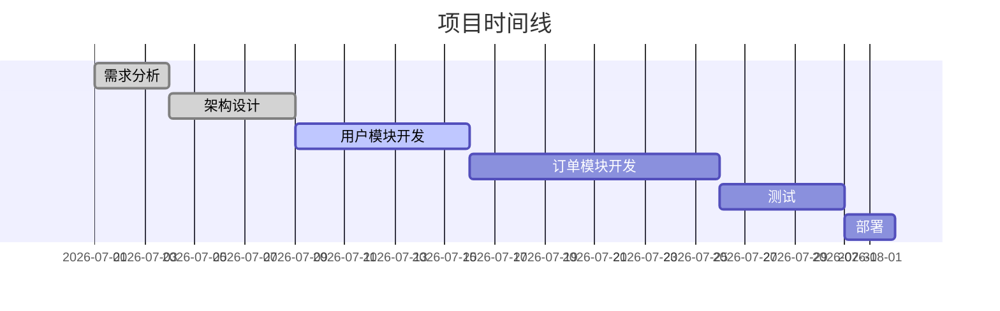

## 具体操作命令手册

### 1. Kanban 任务管理

```python
# 创建开发任务（含父依赖）
kanban_create(
    title="实现用户认证模块",
    assignee="worker-coder",
    parents=["<架构设计任务ID>"],
    priority=15
)

# 创建测试任务（依赖开发任务）
kanban_create(
    title="用户认证模块测试",
    assignee="worker-tester",
    parents=["<开发任务ID>"],
    priority=8
)

# 设置任务依赖关系
kanban_link(parent_id="<父任务ID>", child_id="<子任务ID>")

# 查看待办任务
kanban_list(status='todo')

# 查看阻塞任务
kanban_list(status='blocked')

# 查看任务详情（含父子链）
kanban_show(task_id="<任务ID>")
```

### 2. 任务分解模式

| 分解策略 | 适用场景 | 示例 |
|----------|----------|------|
| **按模块** | 模块边界清晰、耦合度低 | 用户模块 / 订单模块 / 支付模块 各自独立任务 |
| **按层级** | 分层架构，层间接口明确 | API层任务 / 服务层任务 / 数据层任务 |
| **按功能** | 功能点独立可验收 | 登录功能 / 注册功能 / 密码重置功能 |
| **按阶段** | 开发→测试→审查→部署流水线 | 每阶段一个任务，串行依赖 |

```python
# 按模块分解示例
modules = ["user", "order", "payment", "inventory"]
for mod in modules:
    kanban_create(
        title=f"实现{mod}模块",
        assignee="worker-coder",
        parents=["<架构设计任务ID>"],
        priority=10
    )

# 按阶段流水线分解示例
dev_task = kanban_create(title="开发模块", assignee="worker-coder", parents=["<arch-task-id>"])
test_task = kanban_create(title="测试模块", assignee="worker-tester", parents=[dev_task["id"]])
review_task = kanban_create(title="审查模块", assignee="worker-reviewer", parents=[dev_task["id"]])
deploy_task = kanban_create(title="部署模块", assignee="worker-deployer", parents=[review_task["id"], test_task["id"]])
```

### 3. 进度监控

```python
# 查看正在执行的任务
kanban_list(status='running')

# 查看已完成任务
kanban_list(status='done')

# 查看所有阻塞任务（需协调）
kanban_list(status='blocked')

# 发送心跳（长时间运行任务保活）
kanban_heartbeat(note="正在执行集成测试，已完成3/5模块")
```

### 4. 依赖图分析

```python
# 查看任务详情，获取父子依赖关系
task = kanban_show(task_id="<任务ID>")
# 返回中包含 parent_task_ids 和 child_task_ids

# 遍历所有 ready 任务，检查依赖链
ready_tasks = kanban_list(status='ready')
for t in ready_tasks:
    detail = kanban_show(task_id=t['id'])
    print(f"任务: {detail['title']}")
    print(f"  父任务: {detail.get('parent_task_ids', [])}")
    print(f"  子任务: {detail.get('child_task_ids', [])}")
```

### 5. 甘特图/时间线生成

```python
#!/usr/bin/env python3
"""从 Kanban 任务生成 Mermaid 甘特图"""
import json
from datetime import datetime, timedelta

# 假设已通过 kanban_list 获取任务列表
tasks = [
    {"title": "需求分析", "status": "done", "created": "2026-07-01", "duration_days": 3},
    {"title": "架构设计", "status": "done", "created": "2026-07-04", "duration_days": 5},
    {"title": "用户模块开发", "status": "running", "created": "2026-07-09", "duration_days": 7},
    {"title": "订单模块开发", "status": "todo", "created": "2026-07-16", "duration_days": 10},
    {"title": "测试", "status": "todo", "created": "2026-07-26", "duration_days": 5},
    {"title": "部署", "status": "todo", "created": "2026-07-31", "duration_days": 2},
]

print("```mermaid")
print("gantt")
print("    title 项目时间线")
print("    dateFormat YYYY-MM-DD")
for t in tasks:
    status_marker = "done," if t["status"] == "done" else ( "active," if t["status"] == "running" else "")
    end_date = (datetime.strptime(t["created"], "%Y-%m-%d") + timedelta(days=t["duration_days"])).strftime("%Y-%m-%d")
    print(f"    {t['title']} :{status_marker} {t['created']}, {end_date}")
print("```")
```

输出示例：



### 6. GitHub Projects 集成（gh CLI）

```bash
# 列出仓库 Issue
gh issue list --limit 30 --state open

# 按标签筛选
gh issue list --label bug,enhancement

# 查看 Issue 详情
gh issue view <issue-number>

# GitHub Projects（Beta）— 项目项列表
gh project item-list <project-number> --owner <org>

# 列出项目（User / Org 层级）
gh project list

# 在项目中创建 Issue
gh issue create --project <project-number> --title "..." --body "..."
```

### 7. Linear 项目管理

```bash
# 列出团队的活跃 Issue
linear issue list --team <team-name> --status "In Progress"

# 查看 Issue 详情
linear issue view <issue-id>

# 创建 Issue
linear issue create --team <team-name> --title "..." --description "..."

# 列出 Sprint
linear sprint list --team <team-name>

# 列出团队的 Cycles
linear cycle list --team <team-name>
```

### 8. Python 单行脚本 — 项目管理自动化

```bash
# 燃尽图数据生成（从 JSON 任务列表）
python3 -c "
import json, sys
tasks = json.load(sys.stdin)
# 按状态统计
status_count = {}
for t in tasks:
    s = t.get('status', 'unknown')
    status_count[s] = status_count.get(s, 0) + 1
print(f'任务分布: {json.dumps(status_count, indent=2)}')
# 估算剩余工作量
remaining = [t for t in tasks if t.get('status') not in ('done', 'cancelled')]
print(f'待完成任务: {len(remaining)}')
print(f'总任务: {len(tasks)}')
print(f'完成率: {len(tasks)-len(remaining)}/{len(tasks)} = {(len(tasks)-len(remaining))/len(tasks)*100:.1f}%')
" < tasks.json

# 开发速度计算（按周统计已关闭任务）
python3 -c "
from datetime import datetime, timedelta
tasks = [{'title': '模块A', 'status': 'done', 'closed': '2026-07-14'},
         {'title': '模块B', 'status': 'done', 'closed': '2026-07-16'}]
weekly = {}
for t in tasks:
    if t['status'] == 'done':
        closed = datetime.strptime(t['closed'], '%Y-%m-%d')
        week = closed.isocalendar()[1]
        weekly[week] = weekly.get(week, 0) + 1
for w, c in sorted(weekly.items()):
    print(f'第{w}周: {c} 个任务完成')
"

# 依赖图 JSON → DOT 转换
python3 -c "
tasks = [{'id': 'A', 'deps': []}, {'id': 'B', 'deps': ['A']}, {'id': 'C', 'deps': ['A', 'B']}]
print('digraph G {')
for t in tasks:
    for dep in t.get('deps', []):
        print(f'  {dep} -> {t[\"id\"]};')
print('}')
" > deps.dot && dot -Tpng deps.dot -o deps.png && echo '依赖图已生成: deps.png'
```

### 9. Graphviz — 任务依赖可视化

```bash
# 从 DOT 文件生成任务依赖关系图
dot -Tpng task_deps.dot -o task_deps.png

# 布局选项：dot（层次）、neato（弹簧）、fdp（力导向）
dot -Kfdp -Tpng deps.dot -o deps.png

# SVG 输出（可直接嵌入 Markdown 文档）
dot -Tsvg deps.dot -o deps.svg
```

### 10. jq — 任务 JSON 数据处理

```bash
# 统计各状态任务数
jq 'group_by(.status) | map({status: .[0].status, count: length})' tasks.json

# 获取所有优先级 >= 10 的任务
jq '[.[] | select(.priority >= 10)]' tasks.json

# 按创建时间排序并取前 5
jq 'sort_by(.created_at) | reverse | .[:5]' tasks.json

# 输出父任务依赖链
jq '.[] | {title: .title, parents: .parent_task_ids}' tasks.json
```

### 11. Pandoc — 报告生成与转换

```bash
# Markdown → PDF（生成可评审的项目报告）
pandoc report.md -o report.pdf --pdf-engine=xelatex

# Markdown → DOCX（供业务方编辑）
pandoc report.md -o report.docx

# 甘特图 Markdown 嵌入 → 完整项目报告
pandoc gantt_report.md project_status.md -o full_report.pdf \
  --pdf-engine=xelatex -V mainfont='Noto Sans CJK SC'
```

---

---
