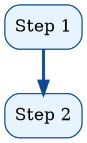

# HTML → PDF with JavaScript Charts

Convert HTML pages containing JavaScript-rendered charts (ECharts, Mermaid, D3) or Graphviz images into print-ready A4 PDFs using Chrome headless. Covers local lib loading, chart-type pitfalls, layout constraints, and verification.

## When to Use

- Generating reports/documents that need charts rendered as PDF pages
- Converting HTML dashboards or data visualizations to print format
- Creating A4-sized documents with embedded flowcharts, route maps, or sequence diagrams
- Any task where `wkhtmltopdf` or `pandoc` can't handle JavaScript charts

## Quick Start

```bash
# 1. Download chart libs locally
mkdir -p libs
curl -sL "https://cdn.jsdelivr.net/npm/echarts@5/dist/echarts.min.js" -o libs/echarts.min.js

# 2. Generate PDF via Chrome headless
"/Applications/Google Chrome.app/Contents/MacOS/Google Chrome" \
  --headless --disable-gpu --no-pdf-header-footer \
  --print-to-pdf=output.pdf \
  --virtual-time-budget=10000 \
  "file:///path/to/input.html"

# 3. Verify
python3 -c "
import fitz
doc = fitz.open('output.pdf')
empty = [i+1 for i,p in enumerate(doc) if len(p.get_drawings()) == 0]
print(f'{len(doc)} pages, empty: {empty or \"none\"}')"
```

## Critical Flags

| Flag | Purpose |
|------|---------|
| `--no-pdf-header-footer` | Strip page title, date, URL, page number from headers/footers |
| `--virtual-time-budget=N` | Wait N ms for JS charts to render (use 8000-10000 for multi-chart pages) |
| `--disable-gpu` | Required for headless rendering |

## Key Pitfalls

1. **CDN loading is unreliable** — download ECharts/Mermaid to `libs/` and reference via relative path (`<script src="libs/echarts.min.js">`)
2. **ECharts `type: 'tree'` is broken** in ECharts 5 — causes `TypeError: Cannot read properties of undefined (reading '__original')` and renders a blank page. Use `type: 'graph', layout: 'fixed'` with explicit `x/y` coordinates instead
3. **Always use `renderer: 'svg'`** in ECharts for crisp vector output
4. **Add `max-height` on chart containers** — oversized charts triggering `page-break-before` on the next section can leave a blank page
5. **Graphviz > Mermaid for flowcharts** — nodes auto-size, layout engine is more stable, no JS dependency

See `references/chart-techniques.md` for detailed ECharts config patterns, Graphviz dot syntax examples, A4 CSS templates, and verification scripts.

## Graphviz Alternative

For flowcharts, route maps, organizational diagrams:



Render: `dot -Tpng -Gdpi=150 input.dot -o output.png` → embed as `` in HTML.

## Verification Checklist

1. No blank pages: every page has `drawings > 0`
2. No header/footer leaks: no file paths, timestamps, or page numbers in top/bottom 40px
3. Charts rendered: no raw JS code visible, all chart containers have content
4. No overflow: `max_x` coordinate < page width on every page
