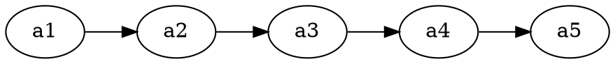

# A4 PDF Diagram Layout

Prevent the four most common diagram-layout failures in A4 PDFs
generated from HTML via Chrome headless. These failures all come from
real user feedback on 2026-08-03 and each has a mechanical fix.

## The Four Failures

| # | User feedback | Root cause | Fix |
|---|---|---|---|
| 1 | "竖版图的文字方向没改过来 看起来很难受" | Rotated the PNG with PIL to change orientation — text rotated too | Regenerate from .dot source (see §1) |
| 2 | "图片和文字互相遮罩" | Chrome print CSS ignores margin-top after chart containers | Add `<div style="height:12px;"></div>` spacer (see §2) |
| 3 | "图片跨页" | `max-height` not set on `.chart-container img` | Set `max-height: 200px` (see §3) |
| 4 | "文字过大" | CSS font-size calibrated for screen not print | Use A4-specific values (see §3) |

---

## §1. Making Vertical Diagrams Horizontal (WITHOUT rotating PNGs)

### 🔴 NEVER rotate PNGs

```python
# WRONG — text rotates with the image
from PIL import Image
img = Image.open("vertical.png")
img.rotate(-90, expand=True).save("horizontal.png")  # text is now sideways!
```

The image rotates but so does all the text inside it — Chinese
characters become sideways and unreadable.

### ✅ Technique 1: `rankdir=LR` for linear chains

For sequence diagrams and simple flowcharts (A→B→C→D):



Produces ratio > 5.0 (wide) with text upright.

### ✅ Technique 2: `unflatten -l N` for tree diagrams

For trees (root → many children), `rankdir=LR` alone isn't enough —
Graphviz still stacks children vertically. Use the `unflatten`
preprocessor:

```bash
unflatten -l 2 input.dot | dot -Tpng -Gdpi=150 > output.png
```

| `-l` value | Effect | Use when |
|---|---|---|
| `-l 1` | minimal spread | 2-3 children |
| `-l 2` | moderate spread | 3-4 children per row |
| `-l 3` | aggressive spread | 5+ children (may not work on chains) |

**Measured result**: 511×1020 (ratio 0.50) → 1271×501 (ratio 2.54).

### ✅ Technique 3: `{ rank=same; ... }` for manual control

When `unflatten` doesn't spread enough:

```dot
{ rank=same; n1; n2; n3; }   // these 3 share a row
{ rank=same; n4; n5; n6; }   // these 3 share the next row
```

---

## §2. Preventing Image-Text Overlap

Chrome's print CSS sometimes ignores `margin-top` on `<p>`, `<h3>`,
and `<div>` elements that follow a chart container. The chart image
overlaps the next text block.

### Fix: explicit spacer div

```html
<div class="chart-container">
  
  <div class="chart-caption">图1：示例</div>
</div>
<div style="height:12px;"></div>   <!-- ← CRITICAL: forces gap -->
<p>下一段文字...</p>
```

Add the spacer after EVERY chart container, before ANY text element.

### Verification

```python
import fitz

doc = fitz.open('output.pdf')
overlap_count = 0

for i in range(len(doc)):
    page = doc[i]
    text_blocks = page.get_text('blocks')
    for img in page.get_images(full=True):
        for rect in page.get_image_rects(img[0]):
            for block in text_blocks:
                if block[6] == 0:  # text block
                    if fitz.Rect(block[:4]).intersects(rect):
                        overlap_count += 1
                        print(f'Page {i+1}: OVERLAP')

print(f'Total overlaps: {overlap_count}')  # must be 0
doc.close()
```

---

## §3. CSS Values for A4 PDF

```css
/* Body — NOT 13px+, which is too large for A4 print */
body {
  font-size: 11px;
  line-height: 1.55;
  max-width: 700px;
}

/* Tables — compact */
table { font-size: 10px; }
th { font-size: 10px; padding: 3px 5px; }
td { font-size: 10px; padding: 3px 5px; }

/* Chart containers — prevent cross-page split */
.chart-container {
  margin: 8px 0;
  page-break-inside: avoid;
  text-align: center;
}
.chart-container img {
  max-width: 90% !important;
  height: auto !important;
  max-height: 200px !important;   /* CRITICAL: prevents page split */
}

/* Captions — small and muted */
.chart-caption {
  font-size: 9px;
  color: #888;
  margin-top: 3px;
  margin-bottom: 6px;
  font-style: italic;
}
```

### Why `max-height: 200px`?

A4 page height ≈ 842pt. With 14mm top + 12mm bottom margins, usable
height ≈ 750pt. A chart taller than 200pt (after CSS scaling) leaves
< 550pt for text — often forcing a page break mid-chart. 200px keeps
charts compact enough to coexist with headings, tables, and text on
the same page.

---

## §4. Full Verification Loop

Run this after EVERY PDF generation to catch all four failures:

```python
import fitz

doc = fitz.open('output.pdf')
issues = []

for i in range(len(doc)):
    page = doc[i]
    text_blocks = page.get_text('blocks')
    
    # Check 1: blank pages
    if len(page.get_drawings()) == 0 and len(page.get_images()) == 0:
        issues.append(f'Page {i+1}: BLANK')
    
    for img in page.get_images(full=True):
        for rect in page.get_image_rects(img[0]):
            ratio = rect.width / page.rect.width * 100
            
            # Check 2: narrow images
            if ratio < 40:
                issues.append(f'Page {i+1}: NARROW ({ratio:.0f}%)')
            
            # Check 3: text-image overlap
            for block in text_blocks:
                if block[6] == 0:
                    if fitz.Rect(block[:4]).intersects(rect):
                        issues.append(f'Page {i+1}: OVERLAP')

if issues:
    print('ISSUES FOUND:')
    for issue in issues:
        print(f'  {issue}')
else:
    print(f'All {len(doc)} pages clean')
doc.close()
```

**Pass criteria**: zero issues.

---

## §5. Why This Skill Exists (Root-Cause Reflection)

On 2026-08-03, the agent produced a 14-page architecture PDF and a
19-page lesson-plan PDF. The user found four layout problems across
SIX rounds of feedback. Each round, the agent patched one symptom
without stepping back to ask "what's the systemic fix?"

The user explicitly asked: **"为什么会出现上面这个简单的错误问题，
感觉不符合Orchestrator及其它agent的能力及定位"**

Root causes identified:
1. **Skipped the design step** — didn't map content→diagram-type first
2. **Used proxy metrics** — `drawings > 0` instead of "can the user read it"
3. **Patched symptoms** — six rounds of one-fix-at-a-time instead of
   one systematic pass
4. **Didn't calibrate CSS for print** — used screen font sizes on A4

This skill encodes the systematic pass so future sessions do it right
the first time: choose diagram type → set CSS values → add spacers →
verify with the loop above.

## Related Skills

- **graphviz-pdf-diagrams** — Graphviz templates, color palette, PNG generation
- **diagram-type-selection** — content→type mapping (do this FIRST)
- **mermaid-pdf-report** — Chrome headless PDF generation pipeline
- **echarts-pdf-rendering** — ECharts-specific rendering bugs
