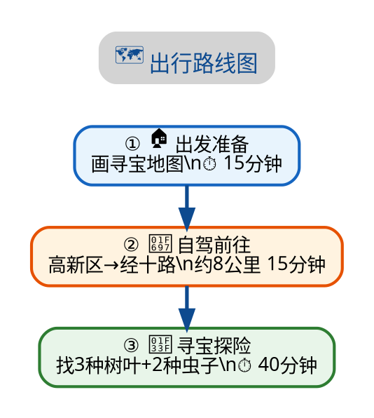

# Graphviz PDF Diagrams

Use Graphviz (`dot`) for flowcharts, route maps, and architecture
diagrams in A4 PDF reports. Graphviz is already installed on macOS
via Homebrew and produces significantly better results than Mermaid
for these diagram types.

## When to Use

- User says "mermaid画的图有点丑" / "不协调" about flowcharts
- Designing route maps or travel itineraries for A4 PDF
- Flowcharts need colored cluster zones (e.g. 内网区/交换区/互联网区)
- Child-friendly diagrams with numbered steps + emoji
- Mermaid's dagre layout engine produces unbalanced/cramped output

## When NOT to Use (Keep Mermaid Instead)

- **Sequence/interaction diagrams** → Mermaid's `sequenceDiagram` is
  its strongest feature, Graphviz has no equivalent
- **Simple 2-3 node diagrams** → Mermaid is faster to write inline
- **Diagrams needing live HTML rendering** (no PNG generation step)

## Tool Selection Matrix

| Diagram type | Best tool | Why |
|---|---|---|
| Sequence/interaction | **Mermaid** | `sequenceDiagram` is Mermaid's strongest feature |
| Flowcharts / process | **Graphviz** | Better auto-layout, node sizing, color control |
| Route maps / itineraries | **Graphviz** | Cluster subgraphs, numbered nodes, colored zones |
| Architecture diagrams | **Graphviz** | `subgraph cluster_*` with `style=filled` |
| Gantt charts | **Mermaid** | Mermaid has native gantt support |
| State diagrams | **Either** | Both work well |

## Graphviz Quick Template

### Chinese + emoji + colored clusters



### Generate PNG

```bash
dot -Tpng -Gdpi=150 input.dot -o output.png
```

### Embed in HTML (for Chrome headless PDF generation)

```html
<!-- Use  tag, NOT <div class="mermaid"> -->
<div style="text-align:center; page-break-inside:avoid;">
  
</div>
```

### CSS for Graphviz images in A4 PDF

```css
.graphviz-img {
  text-align: center;
  page-break-inside: avoid;
  margin: 10px 0;
}
.graphviz-img img {
  max-width: 85%;
  height: auto;
  border-radius: 8px;
}
```

## Key Graphviz Advantages Over Mermaid

1. **Node auto-sizing**: text never overflows node boundaries
2. **Per-node colors**: `fillcolor` + `color` for each node independently
3. **Cluster backgrounds**: `subgraph cluster_*` with `style="rounded,filled"`
4. **Numbered + emoji labels**: `① 🏠` prefix for child-friendly readability
5. **margin parameter**: `margin="0.15,0.08"` controls text padding inside nodes
6. **Stable layout**: Graphviz's layout engine is more predictable than dagre
7. **DPI control**: `-Gdpi=150` for high-resolution print-quality output

## Graphviz Color Palette (for consistent A4 PDFs)

| Zone/Phase | fillcolor | border color (color) | Semantic |
|---|---|---|---|
| 准备/计划 | #e8f4fd | #1565c0 | Blue = calm/planning |
| 交通/路途 | #fff3e0 | #e65100 | Orange = movement |
| 自然/户外 | #e8f5e9 | #2e7d32 | Green = nature |
| 休息/餐饮 | #fffde7 | #f9a825 | Yellow = rest/food |
| 观察/检测 | #f3e5f5 | #7b1fa2 | Purple = examination |
| 创作/输出 | #fce4ec | #c2185b | Pink = creative |
| 安全/警告 | #ffebee | #c62828 | Red = danger |

## Hybrid Pattern: Graphviz + Mermaid in One PDF

For a report that needs both flowcharts and sequence diagrams:

1. **Generate Graphviz PNGs** for all flowcharts/route maps first
2. **Save to `images/` subdirectory** relative to the HTML
3. **Write HTML** with `` tags for Graphviz diagrams and
   `<div class="mermaid">` for sequence diagrams
4. **Generate PDF** with Chrome headless `--no-pdf-header-footer`
5. **Verify** with pymupdf (fitz) — check `page.get_images()` count
   for Graphviz pages and `page.get_drawings()` count for Mermaid pages

## Pitfalls

### Don't use `\\n` in Graphviz labels — use `\n`

Graphviz processes `\n` as newline in label strings. In a .dot file,
use `\n` (single backslash). In Python strings that generate .dot,
use `\\n` (double backslash) to produce a literal `\n` in the output.

### `shape=plaintext` for title nodes

Title/heading nodes should use `shape=plaintext` to avoid drawing a
box around the title text. Connect with `[style=invis]` to position
without visible edge.

### `rankdir=TB` for A4 portrait, `LR` for landscape

A4 portrait is taller than wide. `rankdir=TB` (top-to-bottom) fits
naturally. `rankdir=LR` (left-to-right) may overflow right margin.

### Generate at 150 DPI for print quality

`dot -Tpng -Gdpi=150` produces ~1240px wide images for A4 — sufficient
for print. Higher DPI (300) produces larger files with no visible
improvement on screen.

## Verification

After generating PDF with Graphviz images:

```python
import fitz
doc = fitz.open('output.pdf')
for i, page in enumerate(doc):
    images = len(page.get_images())
    drawings = len(page.get_drawings())
    print(f'Page {i+1}: images={images}, drawings={drawings}')
    # Graphviz pages: images > 0
    # Mermaid pages: drawings > 0, images == 0
doc.close()
```

## Case Study: Mom Game Lessons PDF (2026-08-03)

User said "mermaid画的图有点丑，有什么更好的绘图插件"

**Solution**: Discovered `dot` (Graphviz 15.1.0) already installed via
Homebrew. Replaced all 5 Mermaid flowcharts in a lesson-plan PDF with
Graphviz PNGs. Kept Mermaid only for sequence diagrams.

**Result**: Vision analysis rated Graphviz output 8-8.5/10 for layout,
color, and child-friendliness — significantly better than the Mermaid
versions which were rated "ugly" by the user.

**Files produced**:
- 5 Graphviz `.dot` source files → PNG at 150 DPI
- 5 Mermaid sequence diagrams (kept as-is in HTML)
- Single HTML file with both `` and `<div class="mermaid">` blocks
- Chrome headless PDF generation with `--no-pdf-header-footer`

## Related Skills

- **mermaid-pdf-report** — PDF generation pipeline (Chrome headless,
  --no-pdf-header-footer, virtual-time-budget, fitz verification)
- **mermaid-a4-diagram-design** — Mermaid diagram aesthetics (when
  you must use Mermaid and want it to look good)
- **pdf** — post-generation PDF manipulation (merge, split, etc.)
